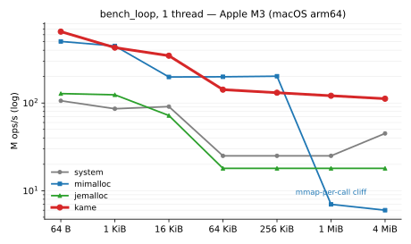
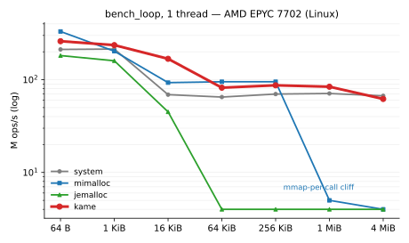
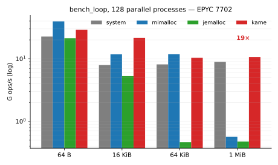
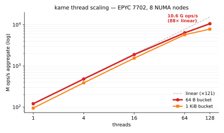

# kamepoolalloc

[](#license)
[]()
[-lightgrey)]()

A lock-free, per-thread, four-tier pool allocator spanning **1 B to multi-GiB** —
bucketed small objects, dedicated mid chunks, `munmap`-backed large blocks, and a
multi-region huge tier for requests above 32 MiB, all freed through one uniform path.  Born for **multi-threaded STM-style
transactional workloads** but usable as a general-purpose drop-in `new` /
`delete` (or C `malloc`) replacement on macOS, Linux, and Windows (MinGW + MSVC).

Carved out of the [KAME](https://github.com/northriv/KAME) measurement framework
and **dual-licensed under Apache 2.0 OR GPL-2.0-or-later** at your choice — so
it can be embedded into permissive / proprietary projects (Apache 2.0 path) or
linked into GPLv2-only projects such as KAME itself (GPL path).
Its sibling library
[**kamestm**](https://github.com/northriv/KAME/tree/master/kamestm) — the
lock-free software transactional memory this allocator was born to serve —
is maintained the same way (dual-licensed, TLA+/GenMC verified) and shares
the `atomic_smart_ptr.h` lock-free smart-pointer header that ships with
this library.

## Highlights

- **Lock-free fast path** — TLS freelist pop/push, no atomics on the hot path.
  Hot-path TLS is `initial-exec` (no `__tls_get_addr` thunk).
- **Four allocation tiers, one `free`** — every pointer is resolved in O(1) by
  a 2-level radix tree, so `free`/`realloc`/`malloc_usable_size` work uniformly
  across all tiers:
  - **Buckets** (1 B .. 32 KiB): 51 size classes.  The ALIGN ≥ 1024 tiers are
    *full-usable* (per-slot metadata in a chunk-header side array, not a borrow
    header), so power-of-2 page requests (4/8/16/32 KiB) get an exact,
    page-aligned slot with **0 % round-up**.
  - **Dedicated chunks** (32 KiB .. 4 MiB): one N-unit chunk from a 32 MiB pool
    region.
  - **Large mmap** (4 MiB .. 32 MiB): one 32-MiB-aligned `mmap` per allocation,
    served warm from the recycle cache, **`munmap`'d on free** when not recycled.
  - **Huge mmap** (> 32 MiB): a multi-region `mmap` per allocation, of which only
    the head 32-MiB radix slot is registered — safe because the allocation's sole
    valid pointer resolves to that slot and the tail slots are never standalone
    lookup targets (and the OS keeps the whole span mapped, so no other allocation
    can claim a tail slot's VA).  **`munmap`'d on free**; bypasses the recycle
    cache (its log index tops out at 32 MiB, so a cached huge block could
    over-satisfy a smaller huge request and pin its RSS — the reason
    libc / jemalloc / mimalloc don't pool their huge class).  Plain libc `malloc`
    is reached only if the `mmap` itself fails.
- **Two-level recycle cache** for the dedicated-chunk and large-`mmap` tiers
  (32 KiB .. 32 MiB; the > 32 MiB huge tier bypasses it): a
  per-thread **L1** (no atomics, ping-pong absorbed) in front of a global
  lock-free **L2** log-slot cache (no working-set cliff, byte-capped).  Reuses
  warm, resident blocks — skips the `mmap`/`madvise`/re-fault cost that makes
  every other allocator fall off a cliff above ~64 KiB.
- **Aligned allocation served from the pool** — `posix_memalign` /
  `aligned_alloc` / `operator new(align_val_t)` up to 4 KiB alignment route to
  the matching bucket (slots are inherently ALIGN-aligned); larger alignments
  use the 256 KiB-aligned dedicated/mmap tiers.  No `_aligned_free` pairing —
  freed by the ordinary `free`.
- **Per-thread DLL chunks** — no global allocator lock, no contention until
  the chunk-claim slow path; cross-thread frees via a holding batch +
  bit-clear coalescing.
- **Lock-free orphan-chunk reclaim (`atomic_shared_ptr`)** — a chunk left
  non-empty by an exited owner thread (its slots still draining via cross-thread
  frees) is pushed onto a per-template lock-free orphan **chain** instead of
  being stranded: another thread later *adopts* it (reuses its free slots) and a
  sweep pass *reclaims* it once drained, so churned worker threads don't grow
  reserved memory.  The chain is built on KAME's `atomic_smart_ptr` (the same
  lock-free reference-counted smart pointer as the STM) — that refcount is what
  makes adopt-vs-reclaim safe without hazard pointers, and a re-owned chunk holds
  a self-referential owner-ref so a concurrent sweeper can't free it mid-reuse.
  Replaces an earlier ABA-tagged Treiber stack that leaked drained orphans.
- **Standards-conformant OOM** — throwing `operator new` runs the installed
  `std::new_handler` loop then throws `std::bad_alloc`; nothrow / C-API paths
  return `nullptr` + `errno = ENOMEM`.  No `std::terminate` across the noexcept
  C boundary.
- **Bounded VA + prompt RSS** — two independent runtime caps:
  `kame_pool_set_max_bytes()` (fresh-region mmap ceiling) and
  `kame_pool_set_large_cache_cap()` (the large-recycle cache's resident
  footprint, split ~half global L2 / ~half aggregate per-thread L1).
  `madvise(MADV_FREE/DONTNEED)` on chunk release — default also at thread exit,
  toggle via `kame_pool_set_thread_exit_reclaim()`.
- **Coexists with a foreign allocator on every OS** — the pool intercepts
  `free`/`delete` the native way per platform so a pointer it allocated is
  pool-freed no matter which module frees it: ELF strong symbols (Linux),
  Mach-O `__DATA,__interpose` (macOS), and a runtime free-family IAT redirect
  on Windows (§31) — the PE/COFF analogue, scoped to the deallocation family,
  so KAME allocations use the pool while Qt / CRT allocations stay on the CRT
  heap and frees are reconciled wherever they happen.
- **Drop-in `malloc` replacement (macOS dylib, default-on)** — when built as a
  standalone dynamic library (`-DKAMEPOOLALLOC_DYLIB`) on macOS, the pool also
  interposes the full `malloc` family by default, so it works as a real
  `DYLD_INSERT_LIBRARIES=libkamepoolalloc.dylib` drop-in like mimalloc / jemalloc
  — every `malloc`/`free`/`realloc` in the host process routes through the pool.
  A `malloc_size` co-interpose returns the true capacity of pool pointers, which
  is what makes this Swift- and Objective-C-safe (the Swift runtime's
  `__StringStorage` and ObjC class realization query `malloc_size`; an allocator
  that lies here corrupts them).  Soak-validated against Foundation, libswiftCore,
  CPython, QtCore, and the C++ STL.  Opt out with
  `-DKAMEPOOLALLOC_CONSERVATIVE_INTERCEPT` for the `free`/`realloc`-only behaviour.
  Linux/Windows dylibs keep this behind the explicit `-DKAMEPOOLALLOC_FULL_INTERCEPT`
  opt-in pending their own soak.  The inline kame.app build (an `MH_EXECUTE`
  image) is unaffected either way — dyld honours `__interpose` only from
  `MH_DYLIB`, so only the strong-symbol `operator new`/`delete` override is live
  there, as before.
- **Verified** — TSAN race-free, UBSAN clean (incl. `vptr`), ASan clean; the
  chunk-claim / chunk-recycle protocol is TLA+ model-checked and the
  large-recycle cache's exclusive-ownership / no-premature-release (UAF /
  double-free) safety is GenMC (RC11) model-checked.  The orphan-chunk
  reclaim/adopt chain is TLA+ model-checked too
  ([`tests/tlaplus/OrphanChain_*.tla`](tests/tlaplus/), run by
  `run_orphan_chain.sh`) — its owner-free-vs-concurrent-sweeper-pin race is a
  model-only catch (runtime stress can't reproduce it), kept as a standing
  regression guard.  Builds 64-bit and 32-bit,
  on macOS / Linux / Windows (MinGW + MSVC).

## Status

**Production-stable in KAME** since 2008 (the lock-free pool joined the
KAME measurement framework — itself in 24/7 research-lab operation since
2002 — as the system allocator that year, and has been the production
allocator on every release since).  The Phase 5 / §15–§30 work (2025 – 2026) added the
buddy chunk allocator, the full-usable page-aligned bucket tiers, the
dedicated / large-`mmap` / huge (> 32 MiB) tiers with a two-level recycle cache,
pool-routed aligned allocation, and standards-conformant OOM.

**Targets:** macOS and Windows (64-bit) for KAME itself; the standalone library
also builds and is tested on Linux (64-bit and 32-bit).  Requires a host with
`mmap` (or `VirtualAlloc`) and threads — not an MCU / bare-metal allocator.

**Per-toolchain status of the live pool:**

| Toolchain | Live pool | Notes |
|---|---|---|
| macOS clang (x86-64 / arm64) | ✅ default | `__DATA,__interpose` `free` redirect; dylib build also interposes the full `malloc` family + `malloc_size` by default (Swift/ObjC-safe drop-in), opt out with `-DKAMEPOOLALLOC_CONSERVATIVE_INTERCEPT`; primary target |
| Linux gcc/clang (x86-64, 32-bit) | ✅ default | strong-symbol `free` redirect; primary CI target |
| Windows **MinGW64 + lld** | ✅ default | §31 free-family IAT redirect lets the pool coexist with Qt / libc++ (PE/COFF has no cross-module `operator new` interposition); verified on-target with Qt 6.10.1 |
| Windows **MSVC** (cl) | ✅ default | runs the full live pool — the `_MSC_VER` shim in `allocator_prv.h` bridges the GCC-isms (`_Interlocked*` atomics, `<intrin.h>` bit-scan / overflow, static-init constructor hook) and the §31 redirect handles Qt/CRT coexistence; opt OUT with `KAME_DISABLE_POOL_MSVC` |

## Benchmarks

Tight alloc/free loop, one slot at a time (`tests/bench/bench_loop.c` —
`malloc(N)` → write `p[0]` → `free(p)` repeated), median of repeated runs.
`kame` is `LD_PRELOAD`'d against the same binary as the others; all are
default-Release builds (no `-flto` / `-march=native` — mimalloc and jemalloc
ship the same way).  Multi-thread numbers run 4 independent `bench_loop`
processes in parallel and sum the per-process rates (true intra-process MT
is measured separately by `bench_xthread`).  All tables below are
reproducible via `tests/bench/bench_compare.sh` (see that script's
`--help`).  The x86-64 reference machine is **Ohtaka** (ISSP supercomputer,
AMD EPYC bare metal — single-tenant, `srun --exclusive`); cloud VM numbers
were intentionally dropped because shared-tenant scheduling jitter on a
single allocator could swing 3× between sessions and made any absolute
comparison unreliable.

<p align="center">
 
 
</p>

The four charts above are plotted from the tables that follow
(regenerate with `tests/bench/plots/make_plots.py`).  The story is the
**flat red curve**: no mmap-per-call cliff at the ≥ 1 MiB tier, and
near-linear scaling to 128 cores.

**Apple MacBook Air M3 (arm64, macOS), single thread, M ops/s** — kamepoolalloc at
`8f2e6980` (word-cache default ON), median of 7 runs via `bench_compare.sh`
(mimalloc 3.3.2 + jemalloc 5.3.0 via Homebrew).  Both M3 tables below were
measured on this commit:

| size      |  system | mimalloc | jemalloc |     kame |
|-----------|---------|----------|----------|----------|
| 64B       |     112 |      544 |      133 |  **739** |
| 1 KiB     |      89 |      485 |      128 |  **500** |
| 16 KiB    |      95 |      208 |       75 |  **573** |
| 64 KiB    |      25 |  **206** |       19 |      154 |
| 256 KiB   |      25 |  **202** |       19 |      142 |
| 1 MiB     |      25 |        7 |       19 |  **130** |
| 4 MiB     |      45 |        6 |       19 |  **119** |

**Apple MacBook Air M3, 4 processes aggregate, M ops/s** — median of 7 runs:

| size      |  system | mimalloc | jemalloc |     kame |
|-----------|---------|----------|----------|----------|
| 64B       |     420 |     1879 |      477 | **2548** |
| 16 KiB    |     337 |      768 |      269 | **2091** |
| 64 KiB    |      90 |  **781** |       66 |      552 |
| 1 MiB     |      91 |       21 |       67 |  **493** |

kame now leads every band except 64–256 KiB.  The **64 B** bucket leads
mimalloc 3.3 — 739 vs 544 M ops/s single-thread, 2548 vs 1879 across 4
processes — after the `deallocate` / `operator new` hot/cold splits (lean
`always_inline` FS=true fast path, no prologue spill), the `KameTlsPage`
fast-TSD unification (§hot-tls, a single `mrs TPIDRRO_EL0` instead of
per-variable `_tlv_get_addr`), and the §word-cache cold path below.  **1 KiB**
flipped to a kame lead (500 vs 485; was 428 vs 447).  At **16 KiB** kame
leads decisively — 573 vs 208 single-thread, 2091 vs 768 4-process — helped
by the void / tail-call FS=false free path.  At the **1 MiB** large tier kame
leads at every thread count: system is lock-serialised, mimalloc collapses to
~7 M single-thread / ~21 M aggregate, while kame stays memory-warm at
130 / 493 M ops/s.  The one band where mimalloc still leads is the
**64–256 KiB** §19 large tier (kame ~150 vs ~205): there the per-free radix
lookup plus recycle-cache bookkeeping cost more than mimalloc's segment
scheme — an already-known weaker tier, not a regression.

### §word-cache — the FS=true cold path (default ON)

Since `8a4d2622` the owner-side recovery of small fixed-size slots runs
through a **claimed-word mask** instead of per-slot work: when the owner
freelist runs dry, ONE bitmap CAS claims every zero bit of a word straight
into the chunk's own cells `[1]` (the mask) / `[2]` (the word base) — unused
under FS=true and on the same cache line as the freelist head the pop just
touched — and each subsequent lean-cold alloc serves a slot with a `ctz` +
clear-lowest + one multiply-add.  No per-slot next-pointer store, no
dependent block-line load, CAS amortised 1/64; the only bit return is the
thread-exit drain.  Hot paths (freelist pop/push) are byte-identical to the
opt-out build (`-DKAME_FS_WORDCACHE=0`).

Measured deltas on M3 (default ON vs opt-out, interleaved medians of 5):
`bench_loop` 1 KiB / 16 KiB and STM `3level_mixed` N=128 (K=10 and K=0)
unchanged; 64 B +25 % (part of which is the known ±10 % build-to-build
layout swing); SPSC producer/consumer ring +29 % at 4 slots in flight and
**+74 %** at 32; `bench_xthread` free-side +10 %.  Cascade Lake-SP shows no
STM regression.  Zen 2 (Ohtaka) numbers pending machine maintenance — by
construction the design carries none of the per-slot stores that capped the
earlier dependency-cut experiments at ~300 M ops/s on that core.

### Third-party suite cross-check (mimalloc-bench, M3)

An independent run of the contention-heavy multi-thread benches from
[mimalloc-bench](https://github.com/daanx/mimalloc-bench) (M3, median of 5,
mimalloc 3.3.2 / jemalloc 5.3.0).  kame is the FS=true word-cache build.

| bench (M ops/s, ↑) | system | mimalloc | jemalloc |      kame |
|--------------------|--------|----------|----------|-----------|
| larson             |   21.4 |    108.3 |    108.6 | **113.0** |
| xmalloc-test       |    150 |  **245** |      118 |       210 |
| rptest             |   2.86 | **3.95** |     3.97 |      2.75 |

kame leads `larson` (the alloc-on-one-thread / free-on-another pattern that
mirrors the STM Snapshot handoff — kame's design target) and clears system /
jemalloc on `xmalloc-test`.  On `rptest`'s mixed cross-thread churn the
segment-based allocators (mimalloc / jemalloc) still lead, and kame sits with
system malloc — the same contention tier flagged as a weaker spot on x86.

**Intel Xeon E5-1630 v4 (x86-64, 4-core / 8-thread, Windows), single thread,
M ops/s** — kame at `8f2e6980` (post hot/cold-split + 32 KiB bucket LUT +
word-cache), llvm-mingw clang 17, median of 5 via `bench_compare.sh`.  On
Windows the `kame` column is the **direct pool route** (`bench_loop_pool` →
`kame_pool_malloc`): PE/COFF has no `LD_PRELOAD`, and llvm-mingw resolves the
plain `malloc` statically (no IAT entry for the §31 redirect to patch), so —
unlike the macOS/Linux tables — this measures the pool core only, not the
malloc-override layer.  mimalloc/jemalloc are not standard on Windows
(columns omitted):

| size      |  system |     kame |
|-----------|---------|----------|
| 64B       |      37 |  **301** |
| 1 KiB     |      40 |  **223** |
| 16 KiB    |      39 |  **191** |
| 64 KiB    |       9 |   **71** |
| 256 KiB   |      10 |   **68** |
| 1 MiB     |      ~0 |   **64** |
| 4 MiB     |      ~0 |   **35** |

**Same host, 4 processes aggregate, M ops/s** — median of 5:

| size      |  system |     kame |
|-----------|---------|----------|
| 64B       |     144 | **1055** |
| 16 KiB    |     134 |  **687** |
| 64 KiB    |      37 |  **238** |
| 1 MiB     |      ~1 |  **231** |

The **system ~0 at ≥ 1 MiB** is the Windows UCRT per-call `VirtualAlloc` /
`VirtualFree` cliff (the same shape mimalloc / jemalloc hit at this tier on
Linux): a tight 1 MiB `malloc`/`free` loop drops below 0.5 M ops/s, while
kame's two-level recycle cache stays memory-warm at 35–231 M ops/s.  The
16 KiB jump (90 → 191 single-thread, 302 → 687 4-process vs the prior
`84f97566` numbers) is the full-range bucket LUT + word-cache landing; no
size regressed.

**Ohtaka (ISSP supercomputer — AMD EPYC 7702, 128-core / 8-NUMA-node, Linux
4 KiB pages, `THP=always`), `bench_compare.sh`, `srun --exclusive`** — kame at
`efbe6dcb` (allocator code `5e127eb5`) for the 1T, 4-process and 128-process
tables below, all measured on the same `i8cpu` node `c15u01n1` (the
`alloc_tune_report` table further down was not re-run and remains at the
earlier `0e9413a6`).  mimalloc/jemalloc versions same as the competitive tables:

**Architecture note — memory renaming**: kamepoolalloc's LIFO freelist
creates a tight store-then-load chain on every alloc/free pair
(`free`: `*p = head; head = p` → next `malloc`: `head = *head`).  On
CPUs with **memory renaming** — Intel Sunny Cove (Ice Lake, 2019) and
AMD Zen 3 (Milan, 2020) onward, plus Apple A12+ / M-series — the
rename stage forwards the just-stored value to the load via the
register file, dispatch-free.  AMD Zen 2 (Ohtaka's EPYC 7702)
**predates this optimization** and pays store-to-load forwarding
latency (~5 cycles) per hot iteration instead.  This is the
structural reason the Ohtaka margins over `mimalloc` / `jemalloc` are
smaller than the M3 figures — most visible at the **64 B tier** where
the freelist hot path dominates (Ohtaka kame 260 vs mi 331, M3 kame
651 vs mi 503 — a 50 % flip in relative position).  Larger tiers
where the freelist is not the bottleneck (16 KiB, 1 MiB+) are not
affected and kame retains its lead on both CPUs.  The 64 B gap is
expected to narrow on Zen 3 / Zen 4 (Milan, Genoa, Bergamo) and on
Sapphire Rapids / Granite Rapids Intel parts; Cascade Lake-SP cloud
VMs (e.g. AWS C5 / GCP N2) inherit the same Skylake-derived non-
renaming microarchitecture and behave like Zen 2 in this respect.

## 1T (median of 5, M ops/s)

| size      |  system | mimalloc | jemalloc |     kame |
|-----------|---------|----------|----------|----------|
| 64B       |     212 |  **331** |      182 |      260 |
| 1.0KB     |     214 |      203 |      160 |  **236** |
| 16KB      |      69 |       93 |       45 |  **168** |
| 64KB      |      65 |   **95** |        4 |       82 |
| 256KB     |      70 |   **95** |        4 |       87 |
| 1.0MB     |      71 |        5 |        4 |   **84** |
| 4.0MB     |      67 |        4 |        4 |   **62** |

## 4 parallel processes (aggregate, M ops/s, median of 5)

| size      |  system | mimalloc | jemalloc |     kame |
|-----------|---------|----------|----------|----------|
| 64B       |     845 |  **1261** |      727 |     1045 |
| 16KB      |     274 |      381 |      177 |  **666** |
| 64KB      |     259 |  **371** |       18 |      321 |
| 1.0MB     |     277 |       20 |       17 |  **335** |

## 128 parallel processes (aggregate, M ops/s, median of 5)

| size      |  system | mimalloc | jemalloc |     kame |
|-----------|---------|----------|----------|----------|
| 64B       |   22634 | **39572** |    21280 |    29044 |
| 16KB      |    7920 |    11808 |     5282 | **21496** |
| 64KB      |    8128 | **11866** |      465 |    10352 |
| 1.0MB     |    8908 |      566 |      475 | **10703** |

At **16 KiB** kame now leads decisively at every thread count — 168 vs 93 M
single-thread, 666 vs 381 at 4 processes, 21496 vs 11808 at 128 (1.8×) —
after the `bucket_for_size` LUT extension to the full 32 KiB bucketed range
(`9b65ce42`) plus the force-inlined size→bucket fold (`0e43ee82`).  At
**1 MiB / 128 processes** kame reaches **10703 M ops/s** (19× ahead of
mimalloc 566 M): the two-level recycle cache keeps all 128 cores at
memory-warm speed while mimalloc stalls at its per-call `mmap` path.  At
**1 KiB** single-thread kame widens its lead over mimalloc (236 vs 203 M, up
from 221) after `5e127eb5` restricted the `new_redirected` large-branch
unlikely-hint to Apple targets — on linux-x86/clang the hint had cost 1 KiB
−15% and 64 B −8% (same-node interleaved A/B) for a +23% gain only at
16 KiB, which the LUT already dominates.  mimalloc still leads at **64 B** on
x86-64 — 331 vs 260 M single-thread, 39572 vs 29044 at 128T: unlike
arm64/M3, where the `deallocate` / `operator new` hot/cold splits put kame
ahead at 64 B, on x86-64 mimalloc's thread-local bump allocator keeps the
edge on the smallest bucket.

---

**Ohtaka, `srun --exclusive`, single-binary self-validation via
`tests/alloc_tune_report`** — kame at `0e9413a6`:

Aggregate M ops/s (`alloc → touch byte 0 → free` loop) at 1 / 4 / 16 / 64 /
128 concurrent threads:

| size,tier                  |  1T  |  4T  |  16T |  64T | 128T |
| -------------------------- | ---: | ---: | ---: | ---: | ---: |
| 64 B  (bucket)             |  121 |  482 | 1887 | 6356 | **10596** |
| 1 KiB (bucket)             |   95 |  389 | 1543 | 5713 |  **7831** |
| 64 KiB (chunk)             |   42 |   27 |  116 |  195 |   **292** |
| 1 MiB (chunk)              |   44 |   31 |   81 |  132 |   **543** |
| 8 MiB (large_va)           |   27 |    3 |    3 |    3 |       3 |
| 40 MiB (large_va, cached)  |   13 |    3 |    3 |    2 |       2 |

The bucket tier reaches **10.6 G ops/s aggregate for 64 B at 128 cores
(88× linear)** — vindicating the per-thread DLL + per-thread freelist +
per-thread `KameTlsPage` design on a heavily-NUMA host.  The 1 MiB chunk tier
peaks at **543 M ops/s at 128T** — the per-thread L1 recycle cache absorbs
the churn without inter-core contention.  The large_va tier (8 MiB+) plateaus
because the benchmark touches byte 0 each cycle, which serialises across
cores in the Linux process-wide `mmap_lock` page-fault path; real KAME
workloads write the whole buffer right after alloc (`memcpy` of acquisition
data, FFT in-place) so the one-page fault is amortised inside the buffer
write, not paid per op.

The same `alloc_tune_report` run self-validated the defaults on this hardware:

- **`LRC_LAZY_INTERVAL_NS = 10 ms`**: 0.63 % per-thread wallclock pressure —
  printed "default 10 ms is fine; auto-tune kept it (raise-only)".
- **`LRC_K_MAX = 256`**: matched to 128 cores — printed "default is
  appropriate".
- **`MADV_HUGEPAGE`**: ineffective on this kernel (same `µs/page` as plain
  first-touch) because `THP=always` is already auto-promoting 4 KiB pages to
  2 MiB at the kernel level.
- **TLB shootdown**: 22.01× worst-case at 128 threads (1543 µs / 32 MiB
  `munmap`) — bounded, not catastrophic; the warm cache absorbs most syscalls
  in practice.

kame leads at every size from 64 B through 1 MiB, single- and multi-threaded.
The **cliff at 256 KiB** is the headline: mimalloc drops from 107 to 3 M ops/s,
jemalloc from 86 to 9 M ops/s — both revert to per-call `mmap`/`munmap`
(≈ 3–9 M ops/s flat), while kame's per-thread recycle cache keeps it at
**115–135 M ops/s** through 1 MiB — a 13–40× lead over the others at this
tier.  The system allocator (glibc ptmalloc) is also flat at large sizes
in this particular tight-loop pattern because ptmalloc adaptively raises
its `M_MMAP_THRESHOLD` when it observes repeated large alloc/free pairs;
in production workloads with mixed sizes, that threshold is not permanently
raised and large allocs revert to per-call `mmap`, closing the same cliff.

The multi-thread picture is the same shape: kame scales through 4 threads
at every tier while jemalloc collapses at 64 KiB (34 M ops/s) and mimalloc
at 1 MiB (12 M ops/s).  These are **touch-first-byte** benchmarks —
`malloc(N)`, write `p[0]`, `free(p)` — so only one page fault is issued per
op regardless of `N`.  Workloads that *write the whole buffer* converge on
memory bandwidth and the per-op allocator cost is amortised.

The point is not the micro-benchmark peak but the **flat curve**: kame has no
size cliff and no per-thread working-set cliff, so a real mixed workload (small
objects + large arrays/waveforms — KAME's own profile) never hits the
`mmap`-per-large-alloc wall the others do.

**Ohtaka — competitive comparison, mimalloc-bench suite** (`sys` = glibc,
`mi3` = mimalloc 3, `mi` = mimalloc, `je` = jemalloc, `tc` = tcmalloc).
Measured on the same EPYC / 128-core / 8-NUMA node as above
(kernel `4.18.0-372.9.1.el8.x86_64`, glibc 2.28, clang 18.1.8); kame at `9ecc613d`,
mimalloc-bench at `941c265d` (allocator versions are whatever that
revision of mimalloc-bench builds via its `build-bench-env.sh`).
Bench invocations: `xmalloc-test -w N -t 5`; `mstress N 50 50`;
`rptest N 0 1 2 500 1000 100 8 16000` (random size 8..16000 B, cross-thread
free rate 2, 500 loops, 1000 allocs, 100 ops per iter):

**xmalloc-test — cross-thread handoff, 64 B objects, M frees/s (higher=better):**

One allocator thread, one free-er thread — the STM Snapshot handoff pattern
where a measurement thread allocates a Payload and the UI thread releases it.

| workers |  sys |  mi3 |   mi |    je |   tc | **kame** |
| ------: | ---: | ---: | ---: | ----: | ---: | -------: |
|       1 |  3.1 | 25.7 | 22.6 |   5.1 |  2.4 |      2.9 |
|       4 |  8.1 | 48.5 | 66.0 |  15.5 |  1.0 |  **8.8** |
|      16 | 29.0 |  119 |  169 |  63.0 | 0.82 | **35.8** |
|      64 | 15.5 |  206 |  262 |   157 | 0.64 | **60.8** |
|     128 |  7.6 |  201 |  176 |   159 | 0.60 | **47.3** |

At ≥ 4 workers kame pulls ahead of glibc; at 64–128 workers it leads glibc
4–6× (glibc's tcache reclaim serialises) while tcmalloc collapses entirely.
kame trails mi / mi3 / je — those are purpose-built for this workload — but
the relevant comparison for KAME deployments is against the system allocator.

**mstress — random object migration across threads, wall time s (lower=better):**

Allocations are passed between threads at random — analogous to STM
Transactions that write a new Payload on one core and the old one is released
on another.

| threads |   sys |  mi3 |   mi |    je |    tc | **kame** |
| ------: | ----: | ---: | ---: | ----: | ----: | -------: |
|       1 | 0.081 | 0.052 | 0.053 | 0.057 | 0.055 |    0.083 |
|       4 | 0.557 | 0.432 | 0.419 | 0.786 | 0.536 |    0.620 |
|      16 |  2.42 |  1.83 |  1.84 |  2.56 |  2.03 |     2.62 |
|      64 |  7.56 |  3.67 |  3.61 |  8.03 |  6.02 | **6.22** |
|     128 |  13.7 |  5.72 |  4.96 |  14.2 |  9.42 | **9.91** |

kame beats glibc at 64–128 threads (the range KAME actually runs at) and
matches it at 1 thread (0.083 vs 0.081 s — margin within run-to-run noise);
it trails glibc at 4–16 threads where glibc's per-thread arena is simpler
than kame's DLL adoption.  kame also beats jemalloc at 64–128T.
mi / mi3 lead throughout.

**rptest — realistic mixed workload, 8..16000 B random sizes,
cross-thread free, long-lived threads, M ops/s (higher=better)** — kame at `9ecc613d`:

Generally regarded as the most production-representative scenario in the
mimalloc-bench suite — long-lived worker threads (not the worker-respawn
pattern of larson), random size distribution spanning small to medium
objects, and a fraction of frees crossing thread boundaries.

| threads |  sys |  mi3 |   mi |    je |    tc | **kame** |
| ------: | ---: | ---: | ---: | ----: | ----: | -------: |
|       1 | 10.9 | 16.7 | 14.8 |  16.3 |  18.7 |     11.5 |
|       4 | 2.90 | 7.81 | 9.97 |  6.46 |  6.41 | **3.96** |
|      16 | 2.27 | 4.46 | 6.42 |  2.78 |  2.12 | **2.31** |
|      64 | 0.48 | 1.68 | 2.68 |  0.77 |  0.24 | **0.74** |
|     128 | 0.31 | 1.32 | 2.23 |  0.45 |  0.05 | **0.32** |

kame beats glibc at every thread count and pulls ahead of tcmalloc at
64–128 threads where tc collapses to 0.05–0.24 M.  At 64T kame (0.74 M)
leads glibc (0.48 M) by 54 % and beats jemalloc (0.77 M) closely, even
while mi3 / mi lead overall.  mi / mi3 / je lead — purpose-built modern
allocators in their target regime — but the relevant comparison for KAME
remains the system allocator, and on a realistic mixed workload kame
holds the line throughout.

## Build

### qmake (KAME-integrated)

```bash
cd kamepoolalloc
qmake kamepoolalloc.pro
make
# produces libkamepoolalloc.dylib (macOS) / libkamepoolalloc.so (Linux)
```

### Standalone (cmake test scaffold)

```bash
cd tests
mkdir build && cd build
cmake .. -DCMAKE_BUILD_TYPE=Release
make
ctest --output-on-failure
```

`ctest` runs the C-API conformance test.  The repo also ships manual
correctness / perf drivers built alongside it: `alloc_stress_test`
(adversarial multi-thread, sentinel-checked), `alloc_minimal_bench`
(single-size hot / fifo loops), and `alloc_bucket34_repro`.  Sanitizer
coverage (TSAN / UBSAN / ASan) is obtained by configuring the build with
the matching `-fsanitize=` flags.

### Windows

- **MinGW64 + lld** (the validated Windows toolchain): builds with the live
  pool on by default.  The qmake test path inline-compiles `allocator.cpp`
  into each test binary (PE/COFF won't let a test bind to the DLL's
  `operator new`), so the test actually exercises the pool; the §31
  free-family redirect installs from the auto-activator to reconcile the
  cross-module frees.
- **MSVC** (cl): runs the full live pool by default — the `_MSC_VER` shim
  in `allocator_prv.h` provides the `_Interlocked*` atomics, the `<intrin.h>`
  bit-scan / `_mul_overflow` mappings, and `NOMINMAX`.  Opt OUT with
  `KAME_DISABLE_POOL_MSVC` to force the `std::allocator` fallback (e.g. when
  bisecting an allocator-suspected issue).
- Env knobs (Windows live pool): `KAME_POOL_WIN_REDIRECT=0` disables the §31
  free redirect (restores the historical unreconciled behaviour);
  `KAME_POOL_VERBOSE=1` prints the patched-slot count at activation.

## Usage

### As a global `new` / `delete` replacement

```cpp
#include "allocator.h"

int main() {
    KamePooledAllocGuard guard;  // static-link only — see note below
    auto *p = new char[256];     // routed to the pool's 256-B bucket
    delete[] p;                  // back to the per-thread freelist
}
```

`KamePooledAllocGuard` is only needed when `allocator.cpp` is compiled
**into the binary or a static library** (the qmake / inline-compiled
path).  When linked as a **shared library** (`-DKAMEPOOLALLOC_DYLIB`,
the cmake test scaffold and any standalone packaging), the dylib
auto-activates from a `__attribute__((constructor(101)))` and the guard
class compiles to an empty stub — write `KamePooledAllocGuard guard;`
either way for portability, or omit it entirely in dylib-only builds.

Pre-`main()` allocations (dyld init, static ctors) always stay on
libsystem malloc regardless of mode.  For static builds the guard
MUST be the first statement in `main()` for the pool to be active
throughout the program.

### Runtime memory cap

```cpp
#include "allocator.h"

int main() {
    KamePooledAllocGuard guard;
    // Cap at 128 MiB: pool will not mmap more than 4 regions
    // (32 MiB each, rounded up).  Beyond the cap, allocations
    // fall back to libsystem std::malloc.
    kame_pool_set_max_bytes(128 * 1024 * 1024);

    // ... your code ...

    fprintf(stderr, "pool reserved: %zu KiB\n",
            kame_pool_reserved_bytes() / 1024);
}
```

Pass `0` to disable the cap (default = compile-time ceiling: 100 GiB
on 64-bit, 3 GiB on 32-bit).

### Explicit C API (no C++ required)

When you cannot interpose `new`/`delete` (static link, sandbox, FFI),
include `<kame_pool.h>` and call the pool directly.  Pure C linkage,
fully reentrant; pre-activation calls transparently fall through to libc.

```c
#include <kame_pool.h>

void *p = kame_pool_malloc(64);
void *q = kame_pool_aligned_alloc(4096, 1 << 20);   // 1 MiB, page-aligned
size_t cap = kame_pool_malloc_usable_size(p);        // bucket-rounded size
kame_pool_free(q);
kame_pool_free(p);

kame_pool_stats_t st = { .version = KAME_POOL_STATS_VERSION };
kame_pool_get_stats(&st);   // regions / live chunks / claimed units
```

### C API reference

Quick index of every public symbol in `<kame_pool.h>`.  All are
pure C linkage, noexcept (`KAMEPOOLALLOC_NOEXCEPT`), thread-safe, and
transparently fall through to libc on pre-activation / post-teardown.
See the header for full per-function semantics.

**Allocation (libc-equivalent surface):**

| Symbol | Purpose |
|---|---|
| `void *kame_pool_malloc(size_t)` | malloc; routes to the bucket/chunk/large-va/huge tier by size |
| `void *kame_pool_calloc(size_t n, size_t sz)` | calloc; mmap'd tiers come zeroed for free |
| `void *kame_pool_realloc(void *, size_t)` | realloc; resize-in-place when the bucket fits, else move |
| `void  kame_pool_free(void *)` | free; libc-foreign pointers transparently pass through |
| `void *kame_pool_aligned_alloc(size_t align, size_t sz)` | C11 aligned_alloc |
| `int   kame_pool_posix_memalign(void **, size_t align, size_t sz)` | POSIX-style aligned malloc |
| `size_t kame_pool_malloc_usable_size(const void *)` | bucket-rounded usable size |

**Runtime caps:**

| Symbol | Default | Purpose |
|---|---:|---|
| `void   kame_pool_set_max_bytes(size_t)` | 100 GiB / 3 GiB 32-bit | upper bound on `reserved` (region VA) |
| `size_t kame_pool_get_max_bytes(void)` | — | current cap |
| `size_t kame_pool_reserved_bytes(void)` | — | bytes of 32-MiB regions currently mapped |
| `void   kame_pool_set_large_cache_cap(size_t)` | ≈ 2 GiB total | LRC_MMAP/CHUNK recycle-cache total cap |
| `size_t kame_pool_get_large_cache_cap(void)` | — | current cap |

**Background maintenance (silenceable for realtime work):**

| Symbol | Default | Purpose |
|---|---|---|
| `void   kame_pool_set_lazy_drain_interval_ms(unsigned)` | 10 ms (auto-tuned at startup) | §28.1 lazy drain interval — bigger = fewer munmap ticks |
| `unsigned kame_pool_get_lazy_drain_interval_ms(void)` | — | current interval |
| `void   kame_pool_set_thread_exit_reclaim(int)` | on | §21 madvise(MADV_DONTNEED) at worker exit |
| `void   kame_pool_set_realtime_mode(int)` | off | §30 one-shot preset: silences all three of the above |

**Observability:**

| Symbol | Purpose |
|---|---|
| `void   kame_pool_get_stats(kame_pool_stats_t *)` | snapshot of regions/units/chunks/cache/tier counters; versioned struct (`KAME_POOL_STATS_VERSION`) |

### Lock-free shared / weak pointer (`atomic_shared_ptr` / `local_shared_ptr`)

`atomic_smart_ptr.h` (an installed public header) provides a lock-free
`atomic_shared_ptr<T>` (atomic, CAS-able shared owner), `local_shared_ptr<T>`
(thread-local owner), and `local_weak_ptr<T>`.  It underpins
[KAME's STM (kamestm)](https://github.com/northriv/KAME/tree/master/kamestm) and the
pool's own orphan-chunk reclaim chain, and is usable on its own.  A technique
deep-dive (local + global refcount, the intrusive `atomic_countable` path, and
a comparison against the libstdc++ / MSVC / libc++ `std::atomic<shared_ptr>`
implementations) lives in
[`kamestm/README.md` § Lock-free atomic shared pointer](https://github.com/northriv/KAME/blob/master/kamestm/README.md#lock-free-atomic-shared-pointer).

The control-block layout is chosen at compile time from `ref_traits<T>`, driven
by an **opt-in marker you inherit on `T`** — no other wiring:

| Inherit on `T`           | Alloc          | `weak_ptr` | Construct with                  | Use for        |
|--------------------------|----------------|------------|---------------------------------|----------------|
| *(nothing — default)*    | 2×             | yes        | `local_shared_ptr<T>(new T(…))` | anything       |
| `atomic_emplaced`        | 1×             | yes        | `make_local_shared<T>(args…)`   | weakable + hot |
| `atomic_strictrefonly`   | 2×             | no         | `local_shared_ptr<T>(new T(…))` | small / cold   |
| `atomic_countable`       | 1× (intrusive) | no         | `local_shared_ptr<T>(new T(…))` | hottest        |

`atomic_weakable` is a back-compat alias for `atomic_emplaced`.

```cpp
#include "atomic_smart_ptr.h"          // on the include path via find_package(kamepoolalloc)

struct Plain { int x; };               // default mode
local_shared_ptr<Plain> a(new Plain{1});
atomic_shared_ptr<Plain> shared; shared.swap(a);   // atomic / CAS-able

struct Hot : atomic_emplaced { int x; };           // 1 allocation; weak_ptr OK
auto h = make_local_shared<Hot>();     // emplaced T: NOT local_shared_ptr<Hot>(new Hot)
```

**Self-referential intrusive node** — a lock-free list/DLL node that embeds an
`atomic_shared_ptr<T>` link is *incomplete* at first use, so the marker cannot be
auto-detected.  Opt in explicitly (before the first use of the pointer) and give
`T` the intrusive contract:

```cpp
template <…> struct force_intrusive_ref<MyNode<…>> : std::true_type {};
struct MyNode {
    typedef uintptr_t Refcnt;
    atomic<Refcnt> refcnt{1};
    atomic_shared_ptr<MyNode> next;     // the self-reference
    // optional: void atomic_intrusive_dispose() noexcept { … }  (else: delete)
};
```

**Circular / incomplete template-id member** — `local_shared_ptr<T>` resolves
its control-block category (`ref_traits<T>`) at *member-declaration* time, since
the method signatures reference the chosen `Ref` (unlike `std::shared_ptr`, which
type-erases the deleter at construction).  The `sizeof(T)` marker probe then
*instantiates* `T`.  A plain incomplete class (`struct N;`) soft-fails to the
non-intrusive fallback, but a not-yet-instantiated class **template-id** —
`local_shared_ptr<Holder<A>>` as a member of `A`, where `Holder<A>` transitively
needs `A` complete — makes the probe force `Holder<A>`'s instantiation, and the
failure is a *hard* error, not soft SFINAE.  Opt out of the probe (the type then
takes the default non-intrusive control block, `local_weak_ptr<T>` still works):

```cpp
template <class X> struct force_incomplete_ref<Holder<X>> : std::true_type {};
struct A { local_shared_ptr<Holder<A>> m; };   // now compiles, like std::shared_ptr
```

Full trait reference: the **USAGE** header block + `ref_traits` /
`force_intrusive_ref` / `force_incomplete_ref` in `atomic_smart_ptr.h`.  Working
self-referential examples: `tests/atomic_intrusive_dispose_test.cpp` and
`tests/atomic_intrusive_chain_test.cpp`.

## Tuning

Most consumers don't need to touch these — the defaults are picked for a few-
to a few-hundred-core machine.  Override via `-D…` at compile time.

### `LRC_K_MAX` — slot count per (idx, kind) in the global L2 recycle cache

Each `LrcKArray` is one cache line (or more) on its own — pushes from
different threads to the same idx land on different cache lines as long as
their `kame_owner_id() & (LRC_K_MAX − 1)` start positions differ.  K therefore
sets the **upper bound on concurrent pushers to one size class that won't
collide on a cache line**.

The default `LRC_K_MAX = 256` is the conservative choice for many-core NUMA
servers.  Smaller K reduces the static slot-array memory AND the cold pop scan
length (each pop scans up to K cache lines for a fit); larger K spreads
contention further.  K must be a power of two.

| Use case | LRC_K_MAX | Static memory (global L2) | Pop cold scan worst |
|---|---:|---:|---:|
| Desktop / few cores | 32 | 10 KiB | 32 lines |
| Single-socket server (~64 cores) | 64 | 20 KiB | 64 lines |
| Multi-socket NUMA (~256 cores) — default | 256 | 80 KiB | 256 lines |
| Huge NUMA (≥ 512 cores or many domains) | 512 | 160 KiB | 512 lines |

K-major (current) over N-major: N-major would compact a band into one cache
line (1-line pop scan) but force every concurrent pusher of that size onto a
SHARED line — catastrophic cache-line bouncing across NUMA nodes.  K-major's
per-K cache-line independence keeps inter-NUMA coherence traffic minimal,
which is the dominant cost on a 256-core node.  Trade-off: pop cold scan is
~K cache-line loads (≈ K × ~50 ns NUMA-remote / ~5 ns hot-cache).

### `LRC_N_MAX` — top size class in the recycle cache

The cache covers `[LRC_LO, LRC_HI]` at 4 indices per octave (= ~19% per
step).  `LRC_LO = ALLOC_MIN_CHUNK_SIZE = 256 KiB`; `LRC_HI = LRC_LO <<
(LRC_N_MAX / 4)`.  Default `LRC_N_MAX = 32` ⇒ `LRC_HI = 64 MiB`.  Sizes above
`LRC_HI` bypass the cache (the index space would otherwise saturate at the
top slot and over-satisfy smaller huge requests — see §27).  Must be a
multiple of 4.

| LRC_N_MAX | LRC_HI | Use case |
|---:|---:|---|
| 24 | 16 MiB | Constrained RSS; never reuse > 16 MiB |
| 32 (default) | 64 MiB | General — covers typical "large buffer" sizes |
| 40 | 256 MiB | Image / FFT / NN workloads with large buffer reuse |
| 48 | 1 GiB | Massive buffer reuse (HPC) |

Raising LRC_N_MAX also adds 4 more idx slots × LRC_K_MAX (`sizeof(atomic) ×
roundup(...)`) per octave to the static slot array.

### `LRC_K_L1` / `LRC_N_MAX_L1` — per-thread L1

L1 is per-thread (TLS), no atomics, no false-sharing concern.  `LRC_K_L1 = 32`
(fixed), `LRC_N_MAX_L1 = 24` covers idx up to 16 MiB.  Per-thread footprint
= `LRC_K_L1 × (LRC_N_MAX_L1 + 1) × 8 B ≈ 6.4 KiB`.  Raise for workloads with
many distinct per-thread sizes.

### `LRC_LAZY_INTERVAL_NS` — §28.1 amortised drain interval

Hardcoded at 10 ms.  Each LRC_MMAP push past this interval evicts one slot
to keep the steady-state cache from growing unboundedly.  On platforms where
`munmap()` is expensive (e.g. very many-core systems with TLB-shootdown
cost), raising this to 100 ms (or higher) trades drain rate for fewer
`munmap` syscalls.  Not currently a `-D…` knob; trivial to expose if
measurement shows it matters.

### Auto-characterise the host (`alloc_tune_report`)

The cmake test suite includes a runnable diagnostic that measures the
host's `mmap` / `munmap` / `madvise` costs, sweeps multi-thread munmap
(to expose TLB-shootdown scaling), benchmarks kamepoolalloc throughput at
every tier, and emits a recommendation block.  Build + run:

```sh
cmake --build <build-dir> --target alloc_tune_report
./<build-dir>/alloc_tune_report [seconds-per-bench, default 2]
```

It is NOT registered as a ctest (long-running, machine-specific output);
intended to be run once per target and the output captured for tuning
discussions.  Recommends concrete `-D…` rebuild flags when it detects
that the defaults are inappropriate (e.g. munmap so expensive that
`LRC_LAZY_INTERVAL_NS` should be raised, or `LRC_K_MAX` mis-sized for the
host's core count).

### Notes for many-core NUMA targets

- TLB shootdown on `munmap` / `madvise(MADV_DONTNEED)` scales with core count.
  The warm cache absorbs most of these — push/pop hit avoids the syscall.
- Pool regions (the 32 MiB units holding bucket-tier + dedicated-chunk
  allocations) are mmap'd push-only — once warmed up there is no munmap on
  them.  The munmap cost is paid only by the §19/§27 large-tier path on cache
  miss/eviction.
- `madvise(MADV_HUGEPAGE)` is NOT currently requested.  If THP is enabled on
  the system, the kernel may transparently coalesce 2 MiB huge pages anyway;
  explicit `MADV_HUGEPAGE` could reduce page-table footprint and TLB-shootdown
  cost.  Not yet measured.

## License

**Dual-licensed under your choice of EITHER:**

- **Apache License, Version 2.0** — see [LICENSE-APACHE-2.0](LICENSE-APACHE-2.0).
  Best for embedding into permissive / proprietary projects.
- **GNU GPL, version 2 of the License, or (at your option) any later version**
  — see [LICENSE-GPL-2.0](LICENSE-GPL-2.0).
  Best for linking into GPLv2-only projects such as KAME itself.

Pick whichever license suits your downstream project; see [LICENSE](LICENSE)
for the full dual-grant statement.

Copyright (C) 2008-2026 Kentaro Kitagawa &lt;kitag@issp.u-tokyo.ac.jp&gt;,
The University of Tokyo, ISSP.

Both license grants explicitly require preservation of the copyright notice
and the choice-of-license clause when redistributing this software, in source
or binary form.

## Roadmap

See [`design/`](design/) for the structural invariant catalogue
([`INVARIANTS.md`](design/INVARIANTS.md) — the blast-radius map for safe
edits) and the §-chapter → subsystem → code navigation map
([`SUBSYSTEMS.md`](design/SUBSYSTEMS.md)).  For deeper rationale see
`git log kamepoolalloc/allocator.cpp` and the §-numbered design notes
([`CHUNK_CLAIM_TLA_NOTES.md`](tests/CHUNK_CLAIM_TLA_NOTES.md),
[`LARGE_RECYCLE_DESIGN.md`](LARGE_RECYCLE_DESIGN.md)).

### Done

- [x] Runtime memory caps (`kame_pool_set_max_bytes` region ceiling +
      `kame_pool_set_large_cache_cap` recycle-cache footprint)
- [x] Apache-2.0 relicense
- [x] Explicit C API (`kame_pool_malloc` / `_free` / `_calloc` / `_realloc` /
      `_aligned_alloc` / `_posix_memalign` family) — `<kame_pool.h>`
- [x] `kame_pool_malloc_usable_size()` public
- [x] Statistics API (`kame_pool_get_stats` — regions, live chunks, units)
- [x] Aligned-alloc served from the pool (§17)
- [x] User-installable OOM handler (`std::new_handler` loop + `bad_alloc`) (§18)
- [x] Large-tier `munmap` on free — VA returned to the OS (§19)
- [x] TSAN / UBSAN (incl. `vptr`) / ASan clean; chunk-claim/recycle TLA+
      model-checked; large-recycle cache ownership/release GenMC (RC11)-checked
      ([`tests/cds/cds_lrc_ownership.c`](tests/cds/cds_lrc_ownership.c))
- [x] 32-bit verified; 16 KiB-page (Apple Silicon) / 64 KiB-page (POWER)
      page-multiple slot layout (§16)
- [x] Windows live pool, default-on for both MinGW64 + lld and MSVC —
      free-family IAT redirect for Qt / libc++ coexistence (§31), `_MSC_VER`
      GCC-ism shim; opt out via `KAME_DISABLE_POOL_MSVC`
- [x] Experimental contrib adaptors — `std::pmr::memory_resource` (covers
      every PMR-aware container + Boost.Container / Folly / abseil),
      `rclcpp::Allocator` for ROS 2 RT nodes, and `Eigen::aligned_allocator`-
      style over-aligned allocator for SIMD/cacheline-aligned buffers — all
      header-only, all concept-conformance tested via `ctest`.  See
      [`contrib/`](contrib/) (also includes an OpenCV `cv::MatAllocator`
      paste recipe)

### Future / nice-to-have

- [ ] Static-buffer mode (`kame_pool_init(buf, len)`) — no `mmap` dependency
      (toward MCU / bare-metal use)
- [ ] Multiple heap instances (per-subsystem isolation)
- [ ] Unified `KAME_POOL_*` env / config surface (hugepages, prewarm, caps)
- [ ] `fork()` safety (`malloc_disable` / `_enable`)
- [ ] musl / uclibc, RISC-V verification

## Design timeline

Carved out of KAME and generalised from "KAME-specific small-object pool" to a
four-tier general allocator.  Selected milestones (full history in `git log`):

| §     | subject |
| ----- | ------- |
| 5l–5u | buddy 32 MiB regions, multi-unit chunks, bucket layout, runtime cap, Apache-2.0 |
| 13    | O(1) `p → chunk` via 2-level radix tree (retires the O(N) region scan) |
| 13.2/13.3 | per-region metadata in unit 0; push-only region list (retire cap-sized globals) |
| 14    | NUMA-aware claim; opt-in hugepages; `kame_pool_get_stats` |
| 15    | forward-shift — every chunk's slot region starts on a 256 KiB boundary |
| 16    | full-usable ALIGN ≥ 1024 tiers — 0 % round-up at power-of-2 page sizes |
| 17    | pool-routed `posix_memalign` / `aligned_alloc` / `operator new(align_val_t)` |
| 18    | standards-conformant OOM (`new_handler` + `bad_alloc`; nothrow / errno) |
| 19    | large-`mmap` tier (4–32 MiB) with real `munmap` on free |
| 20    | fix cross-thread-free `vptr`-after-release UB (UBSAN) |
| 21–23 | thread-exit reclaim default; recycle cache; IE-TLS hot-path slots |
| 24    | `slow_allocate` scans DLL freelists across chunks (multi-chunk working sets) |
| 25    | global lock-free log-slot recycle cache (no working-set cliff) |
| 26    | per-thread L1 recycle log + global L2 — MT scaling without the cliff |
| 27    | serve > 32 MiB from the pool (multi-region mmap; huge class bypasses the cache) |
| 28    | K-line recycle cache (K-major, 1:1 size rounding); lazy drain + auto-tune; sharded stats |
| 29    | FS=true freelist pre-fill at chunk claim (cold-path bitmap scan → O(1) pop; auto-prewarm) |
| 30    | `kame_pool_set_realtime_mode()` — one-call silence of all background maintenance |
| 31    | Windows free-family IAT redirect — pool coexists with Qt / libc++ on PE/COFF |
| 36 / S7 | lock-free orphan-chunk reclaim — `atomic_shared_ptr` chain (owner-exit push, sweep-reclaim, adopt + chunk self-ref owner-ref) replaces the leak-prone ABA Treiber stack; TLA+-verified, now the default |

## Acknowledgements

Designed and implemented by Kentaro Kitagawa.  Phase 4 / Phase 5 refactor
work co-authored with Anthropic Claude (Opus 4.5–4.7) under explicit
direction; all algorithmic and performance decisions reviewed and verified
by the original author.
