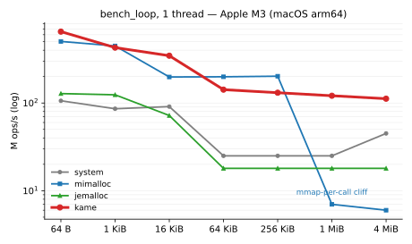

# KAME: AI-Assisted Automation Program for Physical Property Measurements

[](https://www.gnu.org/licenses/old-licenses/gpl-2.0.html)
[](https://github.com/northriv/KAME)
[]()
[](https://arxiv.org/abs/2608.12024)

KAME is an open-source, multi-threaded program for automated physical property measurements,
developed at [Kitagawa Laboratory, ISSP, University of Tokyo](https://kitag.issp.u-tokyo.ac.jp/).
It is particularly suited to NMR and ODMR experiments, and supports AI-assisted measurement
orchestration across compatible instruments.

**License:** GPL v2 or later (prior to 8.0: LGPL v2 or later)
**Authors:** Kentaro Kitagawa, Shota Suetsugu
**Platforms:** macOS, Windows (64-bit), Linux (x86-64, **supported from 8.5** — see `INSTALL.linux`)
**Manual:** [日本語](https://kitag.issp.u-tokyo.ac.jp/%e8%87%aa%e5%8b%95%e5%8c%96%e5%af%be%e5%bf%9c%e6%b8%ac%e5%ae%9a%e3%83%97%e3%83%ad%e3%82%b0%e3%83%a9%e3%83%a0kame/) · [English](https://kitag.issp.u-tokyo.ac.jp/web/kame/kame-7-en.pdf)
**Paper:** K. Kitagawa, *Formally Verified Lock-Free Software Transactional Memory for Scientific Measurement*, [arXiv:2608.12024](https://arxiv.org/abs/2608.12024) (2026)


---

## Features

- Transactional, lock-free node/data model (Software Transactional Memory) —
  spun out as the dual-licensed reusable libraries
  [`kamestm/`](kamestm/) (STM core) and
  [`kamepoolalloc/`](kamepoolalloc/) (four-tier pool allocator) — see
  [Reusable subsystems](#reusable-subsystems)
- Python (+Jupyter notebook) and Ruby scripting — nearly full control from scripts
- **AI-assisted experiment automation via [MCP](https://modelcontextprotocol.io/)** — Claude Code, Codex, and any other MCP client (including local models through Pydantic AI) can read instruments, control parameters, and run measurement sequences through natural language, with the instrument-safety rules delivered by the server itself
- OpenGL-based 2-D / 1-D graph display; arbitrary scalar combinations (T, V, …)
- Real-time NMR relaxation fitting (T1, T2, Tst.e.), Inverse Laplace Transform
- Fourier step-sum spectrum measurement with field / frequency sweeping
- Complete data logging with post-measurement re-analysis
- Save / restore full measurement config to `.kam` files
- Modular driver plug-in architecture; Python drivers redefinable at runtime
- Calibration curves (cspline, Chebyshev, polynomial) for resistance thermometers and generic sensors; calibrated entries feed into graphs, charts, and data recording like any native scalar

### Released versions/Binaries
Source: [kame-8.5.zip](https://kitag.issp.u-tokyo.ac.jp/web/kame/src/kame-8.5.zip) (4.7MB, Aug. 2026).
[All other source archives](https://kitag.issp.u-tokyo.ac.jp/web/kame/src).
Windows 64-bit binaries: [8.5](https://kitag.issp.u-tokyo.ac.jp/web/kame/src/kame-win32-llvm64-8.5.zip) (20.4MB) · [8.4](https://kitag.issp.u-tokyo.ac.jp/web/kame/src/kame-win32-llvm64-8.4.zip). At least Qt is additionally needed, follow instructions below to install.

### Supported instruments

| Category | Models |
|---|---|
| **Oscilloscopes (DSO)** | Tektronix TDS, Lecroy/Teledyne/Iwatsu, Thamway PROT3 streaming DSO, Thamway DV14U25 A/D board, NI-DAQmx as DSO, Digilent WaveForms AIN |
| **Signal generators** | Kenwood SG7130/7200, HP/Agilent 8643/8644/8648/8664/8665, Keysight/Agilent E44xB SCPI, Rohde-Schwarz SML01/02/03/SMV03, DSTech DPL-3.2XGF, LibreVNA SG SCPI |
| **Function / pulse generators** | NF WAVE-FACTORY, LXI 3390 arbitrary function generator |
| **Network analysers** | HP/Agilent 8711/8712/8713/8714, Agilent E5061/E5062, Copper Mountain TR1300/1504/4530, DG8SAQ VNWA3E, LibreVNA SCPI, Thamway T300-1049A impedance analyser |
| **Lock-in amplifiers / bridges** | Stanford SR830, NF LI5640, Signal Recovery 7265, LakeShore M81-SSM, Agilent/HP 4284A LCR meter, Andeen-Hagerling 2500A capacitance bridge |
| **DC sources** | Yokogawa 7651, Advantest TR6142/R6142/R6144, MICROTASK/Leiden triple current source, Optotune ICC4C-2000 |
| **Multimeters / picoammeters** | Keithley 2000/2001, 2182 nanovolt meter, 2700+7700, 6482 picoammeter; Agilent 34420A, 3458A, 3478A; Sanwa PC500/5000 |
| **Temperature controllers** | Cryocon M32/M62, LakeShore 218/340/350/370/372 (1ch, 8ch, 16ch scanner), Picowatt AVS-47, Oxford ITC-503, Neocera LTC-21, Scientific Instruments 9302/9304/9308, LinearResearch LR-700, OMRON E5\*C Modbus |
| **Magnet power supplies** | Oxford PS-120, Oxford IPS-120, Cryogenic SMS10/30/120C |
| **NMR pulsers** | Thamway N210-1026 PG32U40 (USB), PG027QAM (USB), N210-1026S/T (GPIB/TCP); NI-DAQ analog+digital output, digital output only, M+S Series; handmade H8, handmade SH2 |
| **NMR / RF measurement** | Thamway PROT NMR (USB/TCP), NMR FID/echo analyser, T1/T2 relaxation, field-swept spectrum, frequency-swept spectrum, NMR built-in network analyser, NMR LC autotuner |
| **Cameras / imaging** | IEEE 1394 IIDC, Euresys eGrabber (CoaXPress), Euresys Grablink (CameraLink), Hamamatsu via Grablink, JAI via Grablink, OceanOptics/Insight USB/HR2000+/4000 spectrometer |
| **Laser modules** | Coherent Stingray, Newport/ILX LDX-3200, Newport/ILX LDC-3700(C) |
| **ODMR** | Frequency-swept spectrum, FM peak tracker, 2-D image analysis, filter wheel (STM-driven) |
| **Motors / positioners** | OrientalMotor FLEX CRK, CVD2B, CVD5B, FLEX AR/DG2, EMP401; SigmaOptics PAMC-104 piezo-assisted; Micro CAM z/x/φ; Two-axis rotator |
| **Flow controllers** | Fujikin FCST1000 series |
| **Level meters** | Oxford ILM helium level meter, Cryomagnetics LM-500 |
| **Vacuum gauges** | Pfeiffer TPG361/362 |
| **Pump controllers** | Pfeiffer TC110 turbopump controller |
| **Counters** | Mutoh Digital Counter NPS |
| **Quantum Design PPMS** | PPMS low-level interface |
| **NI DAQmx** | Pulser (AO+DO, DO-only, M+S Series), DSO |
| **Resistance measurement** | Four-terminal with polarity switching; Python-based 4-terminal (simple and multi-current variants) |
| **Monte Carlo simulation** | Monte Carlo driver |

---

## What's New in 8.0

- **MCP server for AI-assisted experiment automation** — built-in [Model Context Protocol](https://modelcontextprotocol.io/) server lets AI assistants execute Python code in the running KAME process, read instrument values, and control measurements through natural language. One-click launches for Claude Code, Codex and a vendor-neutral Pydantic AI client (any `provider:model`, local models included) all point at the same server. Matplotlib plots are returned inline; long-running experiments (sweeps, scans) run asynchronously. Shipped as an [Agent Plugins 1.0.0](https://agent-plugins.org/) plugin bundling the server with a measurement skill.
- **Calibrated scalar entries** — `XCalibratedEntry` applies a calibration curve to any scalar entry; the result appears in graphs, charts, and data recording like a native scalar.
- **Usermode NI USB-GPIB on Apple Silicon** — the embedded userspace linux-gpib port now works reliably on macOS ARM64 without any kernel module.
- **Window cascade placement** — instrument windows are automatically arranged on show.
- **Comprehensive bug audit** — 20 bug fixes across 12 source files (GIL safety, buffer bounds, null-pointer guards, logic errors).
- **Arbitrary mask support for 2D math tools** — ROI math tools (Average, Sum) now support arbitrary binary masks in addition to Rectangle and Ellipse shapes. Masks can be set programmatically from Python via `setArbitraryMask()`. Highlighted masks are rendered as GPU textures.
- **Math tool API cleanup** — ROI endpoint naming changed from `Begin/End` to `First/Last` (inclusive endpoints, avoids STL naming confusion). Added `imageWidth()`/`imageHeight()` to `X2DImagePlot` for Python access. Old `.kam` files with `Begin/End` names load transparently via compatibility aliases.

---

## Architecture

### Reusable subsystems

Two pieces of KAME's foundation are maintained as **stand-alone dual-licensed
libraries** (Apache 2.0 OR GPL-2.0-or-later) within this monorepo, intended to
be carved out as their own subtrees for downstream embedding:

- **[`kamestm/`](kamestm/) — Lock-free software transactional memory.**
  The snapshot / transaction core (`Node<XN>`, `Snapshot<XN>`, `Transaction<XN>`;
  plus the `atomic_shared_ptr<T>` engine, homed in `kamepoolalloc/`) extracted as a
  header-only library plus three small `.cpp` (`threadlocal` / `xthread` / `xtime`).
  TLA+ specs for the protocol; GenMC RC11-checked C translations.  Builds on
  macOS clang / Linux gcc/clang (64+32-bit) / Windows **MinGW + MSVC**, and the
  registered standalone test suite passes on each (the exact test count is
  platform-dependent).  See [`kamestm/README.md`](kamestm/README.md).
- **[`kamepoolalloc/`](kamepoolalloc/) — Four-tier lock-free pool allocator.**
  1 B to multi-GiB span (buckets / dedicated chunks / large `mmap` / huge),
  per-thread DLL + cross-thread coalescing, two-level recycle cache, TLA+ /
  GenMC verified, drop-in `new` / `delete` replacement.  Coexists with foreign
  allocators on every OS via the native interposition: ELF strong symbols on
  Linux, Mach-O `__DATA,__interpose` on macOS, free-family IAT redirect on
  Windows (§31).  Builds on the same four toolchains; MSVC live pool is
  default-on (opt OUT with `KAME_DISABLE_POOL_MSVC`).  See
  [`kamepoolalloc/README.md`](kamepoolalloc/README.md) and the
  [INVARIANTS](kamepoolalloc/design/INVARIANTS.md) / [SUBSYSTEMS](kamepoolalloc/design/SUBSYSTEMS.md)
  navigation map.

<p align="center">
<a href="kamepoolalloc/README.md#benchmarks"></a><br>
<i>kamepoolalloc vs system / mimalloc / jemalloc — single-thread malloc/free
sweep on Apple M3.  No size cliff; <a href="kamepoolalloc/README.md#benchmarks">full benchmarks</a>
(x86-64 bare metal, 128-core scaling, mimalloc-bench suite).</i>
</p>

The rest of this Architecture section describes how KAME itself uses these
pieces — instrument drivers, Python integration, `.kam` serialization, and
how the STM machinery from `kamestm/` is wired into the node tree.

### Driver / Plug-in Architecture

Instrument drivers are **shared libraries** under `modules/` loaded at runtime via `ltdl`.
Each driver subclasses `XDriver` (`kame/driver/driver.h`), which carries a timestamped
`Payload` (`time()` = phenomenon time, `timeAwared()` = acquisition start time) and emits
`onRecord` / `onVisualization` signals.

Hardware communication is abstracted in `modules/charinterface/` (serial, TCP, GPIB, USB).
Drivers can also be subclassed in Python via `XPythonDriver` (`kame/driver/pythondriver.h`).

Scalar values extracted from driver records are represented as `XScalarEntry` objects
(`kame/analyzer/`). A derived `XCalibratedEntry` applies any registered calibration curve
to an existing entry, and the result appears in graphs, charts, and data recording
exactly like a native scalar. Calibration curves (`kame/thermometer/`) include cubic
spline (`XApproxThermometer`, `XGenericCalibration`), Chebyshev polynomial (`XLakeShore`),
and polynomial (`XScientificInstruments`) types. `XGenericCalibration` supports
user-configured labels and units, making it applicable to any sensor, not just thermometers.

#### Usermode NI USB-GPIB

`modules/charinterface/usermode-linux-gpib/` contains a userspace port of the NI USB-GPIB
kernel driver from linux-gpib 4.3.6. The upstream `ni_usb_gpib.c` is minimally patched
(Linux-only headers guarded with `#ifdef __KERNEL__`); a compatibility header
(`osx_compat.h` / `win_compat.h`) replaces every Linux kernel API — `kmalloc`, spinlocks,
wait queues, USB URBs — with POSIX/libusb or Win32 equivalents.

The result is a standalone executable that speaks to NI USB-B, USB-HS, USB-HS+, KUSB-488A,
and MC USB-488 adapters on macOS, Linux, and Windows without installing a kernel module or
any proprietary driver. On macOS this is the only viable path for USB-GPIB on Apple Silicon.

### Python Integration

*This section was drafted with AI assistance (Anthropic Claude) and technically reviewed and verified by the maintainers.*

Python access is provided via [pybind11](https://pybind11.readthedocs.io/). The embedded
interpreter runs in its own OS thread; the Qt main thread and the Python thread communicate
through the Talker/Listener signal mechanism.

**Accessing the node tree from Python:**

```python
root = Root()                      # root of the instrument node tree

# Read a value (Snapshot)
shot = Snapshot(root)
print(shot[root])                  # payload of the root node

# Navigate children
tempcontrol = root["tempcontrol"]  # by name
print(float(tempcontrol["temp"]))  # XDoubleNode coerces to float

# Write a value (Transaction)
for tr in Transaction(tempcontrol["setpoint"]):
    tr[tempcontrol["setpoint"]] = 4.2   # retry loop, just like C++
```

**Writing instrument drivers in Python:**

Any C++ driver base class can be subclassed in Python via `XPythonDriver<T>`.
The subclass is registered at runtime with `exportClass()` and instantiated by the
framework exactly like a compiled driver. This enables rapid prototyping of new
instrument interfaces without recompiling KAME.

```python
class MyDriver(kame.XPythonCharDeviceDriverWithThread):
    def analyzeRaw(self, reader, payload):
        payload.local()["value"] = float(reader.pop_string())
    def visualize(self, shot):
        ...
MyDriver.exportClass("MyDriver", MyDriver, "My Instrument")
```

The driver's `Payload.local()` dict is deep-copied per transaction, giving Python
state the same snapshot-isolation semantics as C++ Payload fields.

**Jupyter notebook support:**

KAME optionally embeds an IPython kernel. When IPython is available, a Jupyter client
can connect to the running process for interactive exploration and live plotting
alongside the native KAME UI. The kernel integrates with the asyncio event loop via
a custom ipykernel integration (`loop_kamepysupport`).

**AI-assisted experiment automation (MCP):**

KAME includes an [MCP](https://modelcontextprotocol.io/) (Model Context Protocol) server
that lets an AI assistant execute Python code directly in the running KAME interpreter.
The MCP server connects to the embedded IPython kernel, giving the AI full access to
`Root()`, `Snapshot()`, `Transaction()`, and all loaded drivers — the same environment
available in Jupyter notebooks. Any MCP client works: Claude Code, Codex, and a bundled
Pydantic AI client that reaches any `provider:model`, local models included.

This enables scenarios like:
- Conversational experiment control ("sweep temperature from 100 K to 300 K and record resistance")
- Automated data collection with adaptive logic
- Real-time monitoring and analysis

See [MCP setup](#mcp-setup-ai-assisted-experiment-automation) below for configuration.

**Threading notes:**

- Long-running C++ calls release the GIL (`gil_scoped_release`) so the Python thread
  does not block Qt.
- Any Qt UI operation (loading `.ui` files, showing forms) must be dispatched to the
  main thread via `kame.kame_mainthread(closure)`.
- Payload garbage collection uses a deferred deque + mutex to avoid holding the
  GIL during snapshot cleanup (GIL-enabled builds only); Python 3.13 free-threading
  (`Py_GIL_DISABLED`) is also supported.

### Serialization (`.kam` files)

A `.kam` file is a Ruby script generated by `XRubyWriter` and re-executed on load.
Nodes marked `runtime=true` are written as comments and not restored.
`XListNode` children are recreated via `createByTypename()`; the typename must match
the key registered in `XTypeHolder`.

### Software Transactional Memory (STM)

KAME's core data model is a lock-free, snapshot-based STM
(`kamestm/transaction.h` — see [Reusable subsystems](#reusable-subsystems)).
All instrument data lives in a tree of `Node<XN>` objects; reads and writes are
expressed as **snapshots** and **transactions** rather than locks.

```
Node<XN>
 └─ Linkage  ──atomic_shared_ptr──▶  PacketWrapper
                                          └─ Packet
                                              ├─ Payload   (user data)
                                              └─ PacketList (child packets)
```

**Reading — O(1) snapshot:**

```cpp
Snapshot<NodeA> shot(node);         // atomic load, no lock
double x = shot[node].m_x;
```

**Writing — optimistic transaction with automatic retry:**

```cpp
node.iterate_commit([](Transaction<NodeA> &tr) {
    tr[node].m_x += 1;             // copy-on-write on first access
});                                 // retried automatically on conflict
```

**How commits work:**

1. `Transaction` saves `m_oldpacket` at construction.
2. `operator[]` clones the payload (copy-on-write) on first write, stamping it with a unique serial.
3. `commit()` does a single CAS on `Linkage`; if `packet != m_oldpacket` a conflict is detected and the transaction retries.
4. Listeners receive deferred events only after a successful commit — no intermediate states are visible.

#### Lock-free atomic shared pointer

The O(1) snapshot reads and CAS-based commits above require a shared
pointer that is itself lock-free.  `atomic_shared_ptr` (introduced in
January 2006 as part of the 2.0-beta3 rewrite) provides this — a custom
implementation of what C++20 calls `std::atomic<shared_ptr>`, built on
tagged-pointer CAS with a small local reference counter packed into the
pointer's low bits.  It lives in
[`kamepoolalloc/atomic_smart_ptr.h`](kamepoolalloc/atomic_smart_ptr.h),
the **single shared home** for the lock-free primitives that BOTH the STM
and the pool allocator rely on.

Technique deep-dive (local + global refcount, intrusive
`atomic_countable` path, comparison against the libstdc++ / MSVC / libc++
`std::atomic<shared_ptr>` implementations) lives in
[`kamestm/README.md` § Lock-free atomic shared pointer](kamestm/README.md#lock-free-atomic-shared-pointer)
— single source of truth, shared with the standalone kamestm library
release.

**Multi-node consistency** is achieved through a *bundling* protocol: a parent packet absorbs child packets via multi-phase CAS protocol, making the entire subtree consistent under a single atomic pointer. A `m_missing` flag marks packets with stale children, driving re-bundling on demand.

**Collision negotiation:** when concurrent transactions repeatedly collide,
the negotiate machinery (`ScopedNegotiateLinkage::_negotiate()`) lets the
single *oldest* transaction win — each contended linkage is tagged with the
tagger's start-time stamp (oldest-wins), a starved Tx escalating to a
privileged Reserved tag; non-privileged contenders **park** until it commits,
so the oldest/highest-priority Tx makes progress ahead of the contenders parked
behind it. Model-checked livelock-free in TLA+ (exhaustively for the checked,
finite thread counts and tree shapes — not a proof for arbitrary deployment
sizes). Full details + the comparison
against other STMs (Haskell `TVar` / Clojure `Ref` / ScalaSTM, HTM TSX/RTM,
TinySTM / NOrec) live in [`kamestm/README.md`](kamestm/README.md) — KAME's
STM core is dual-licensed and maintained as a standalone library, with its
own design doc to avoid duplicating it here.

`iterate_commit_while(lambda)` lets the caller abort the retry loop (return `false` from the lambda to stop), enabling conditional transactions.

> **Caution:** Taking a nested `Snapshot` inside a transaction can trigger bundling, which may cause the transaction's CAS to always fail. This is not a data corruption issue but a liveness issue — the transaction retries indefinitely. This occurs when the `Snapshot` target is an ancestor of the transaction target, or when hard links exist (a child with two parents) and a `Snapshot` on one parent's tree interferes with the other. Use `tr[*node]` instead of a nested `Snapshot` in these situations.
>
> The hard-link case is now formally modelled in `kamestm/tests/tlaplus/BundleUnbundle_hardlink_*.tla` (seven topology/pattern variants, incl. the conditional nested-sub-bundle gate-scope model); see `kamestm/tests/VERIFICATION.md` §5.

#### Why STM in a measurement framework

Laboratory software must acquire data on tight hardware timings while
simultaneously updating a UI and running user scripts — all from different
threads. Traditional mutex-based designs either serialize too aggressively
(dropping samples) or require intricate lock ordering that is error-prone
to extend. The STM approach offers three concrete benefits for this domain:

- **Deadlock-free by design.** No locks are held across hardware I/O or UI redraws,
  so a slow UI thread does not block a fast acquisition thread behind a lock.
- **Consistent multi-instrument views.** A `Snapshot` of any subtree is always
  internally consistent — the UI always sees a coherent set of readings even when
  multiple drivers update simultaneously.
- **Safe scripting from Python/Ruby.** Scripts read and write the node tree through
  the same transaction API as C++ code, so a user script cannot leave the node
  tree in a partially-updated state, whenever it runs.

For *what makes KAME's STM distinctive* among STMs (tree-structured /
per-packet conflict granularity / bundling instead of read-write logs),
see the [comparison tables in `kamestm/README.md`](kamestm/README.md#comparison-with-other-stm-designs).

#### Formal verification (TLA+)

The STM *protocol* is formally specified and exhaustively model-checked with
TLA+ / TLC for the documented finite thread counts and tree topologies. This is
model checking of the protocol model, not a proof of the C++ implementation for
arbitrary deployment sizes, compiler mappings, or real-time WCET:

- **Layer 1 — `atomic_shared_ptr`:** tagged-pointer CAS protocol with local/global reference counting, drain release, and `scoped_atomic_view` ([spec](kamestm/tests/tlaplus/atomic_shared_ptr.tla)). Safety only — the bare primitive is intentionally *not* livelock-free.
- **Layer 2 — bundle/unbundle + commit:** 2-/3-level subtree bundling with a livelock-free privileged-TID negotiate mechanism, static and dynamic (online insert/release) ([2-level](kamestm/tests/tlaplus/BundleUnbundle_2level_LLfree.tla), [3-level](kamestm/tests/tlaplus/BundleUnbundle_3level_LLfree.tla), [dynamic](kamestm/tests/tlaplus/BundleUnbundle_2level_LLfree_dynamic.tla)). Exhaustively model-checked **safe + livelock-free** without `CONSTRAINT` (the LL-free design makes the state space naturally finite — no artificial bound); the largest single exhaustive run reaches **~641 M distinct states** (3-level all-root, 15 h on the ISSP ohtaka supercomputer), over a billion across the LL-free configurations combined. (Raw state counts are **spec-version-specific** and shift as the spec evolves — see [kamestm/tests/VERIFICATION.md](kamestm/tests/VERIFICATION.md) §3–§4 for current-spec figures.) These are exhaustive results for the checked configurations (fixed thread counts and tree shapes), not an unbounded ∀-thread proof.
- **Hard-link topologies:** multi-parent / one-child races that reproduce and fix a production abort via a Phase-4 reachability gate and a Phase-3 skip-Null fix (`kamestm/tests/tlaplus/BundleUnbundle_hardlink_*.tla`).

**Slide decks** — start at the **coverage overview** ([EN](https://northriv.github.io/KAME/kamestm/tests/tlaplus/doc/slides_overview_en.html) · [JA](https://northriv.github.io/KAME/kamestm/tests/tlaplus/doc_ja/slides_overview.html)), a hub linking every layer with a full coverage matrix. Individual decks (each with a Japanese counterpart under `doc_ja/`): [Layer 1](https://northriv.github.io/KAME/kamestm/tests/tlaplus/doc/slides_layer1_en.html), [Layer 2 base](https://northriv.github.io/KAME/kamestm/tests/tlaplus/doc/slides_layer2_en.html), [Layer 2 LLfree](https://northriv.github.io/KAME/kamestm/tests/tlaplus/doc/slides_layer2_LLfree.html), [3-level](https://northriv.github.io/KAME/kamestm/tests/tlaplus/doc/slides_layer2_LLfree_3level_en.html), [dynamic](https://northriv.github.io/KAME/kamestm/tests/tlaplus/doc/slides_layer2_LLfree_dynamic_en.html), [hard-link](https://northriv.github.io/KAME/kamestm/tests/tlaplus/doc/slides_hardlink_en.html).

C11 translations of each layer are verified with [GenMC](https://github.com/MPI-SWS/genmc) under the RC11 memory model: TLA+-derived tests (`kamestm/tests/tlaplus/test_*.c`) and C++-derived protocol tests (`kamestm/tests/cds_atomic_shared_ptr/`). Full results: [`kamestm/tests/VERIFICATION.md`](kamestm/tests/VERIFICATION.md).

---

## Dependencies

| Library | Notes |
|---|---|
| **Qt** ≥ 5.7 or Qt 6 | Qt 6 needs `uitools`; the Qt5 compatibility module is **no longer** required |
| **Ruby** | scripting |
| **pybind11** | Python scripting |
| **GSL** | |
| **FFTW 3** | |
| **Eigen 3** | |
| LAPACK / ATLAS / BLAS *(optional)* | |
| **libtool-ltdl** | runtime plug-in loading |
| **zlib** | |
| **libusb** | USB instrument interfaces |
| linux-gpib or NI 488.2 *(optional)* | GPIB interfaces |
| NI DAQmx *(optional)* | NI data-acquisition hardware |

A C++11-capable compiler is required (the build uses `CONFIG += c++11` via qmake).

Optional: IPython / Jupyter notebook, linux-gpib or NI 488.2, NI DAQmx,
libdc1394 (IIDC cameras, macOS/Linux), Euresys eGrabber SDK (frame grabbers).

---

## Building

### macOS

> Open `kame.pro` in **Qt Creator** (use the genuine open-source Qt, **not** the MacPorts Qt).

Install dependencies via MacPorts:

```sh
sudo port install gsl fftw-3 libtool-ltdl libusb eigen3 pybind11
```

Optionally, for a universal (arm64 + x86_64) binary, build fftw-3 with:

```sh
sudo port install fftw-3 +universal +clang13 -gfortran
```

Additional notes:

- Add `/opt/local/bin` to PATH in the Qt Creator build-environment pane if needed.
- In Qt Creator's **executable environment** pane, **deactivate** "Add build library search path to DYLD_LIBRARY_PATH …", otherwise KAME crashes on launch.
- If `ruby.h` is not found, reinstall Xcode command-line tools: `xcode-select --install`.
- Qt 6: the **Qt5 compatibility module is no longer needed** — the last user of it was a dead `QTextCodec` include, now removed.
- NI 488.2 is not supported on Apple Silicon; use the built-in usermode NI USB-GPIB driver instead (no kernel module required).

---

### Linux (x86-64, Qt 6 / GCC) — *supported from 8.5*

> Build from source; there is no packaged Linux binary yet.  Full notes,
> including the serial/GPIB smoke test and the remaining gaps, are in
> **`INSTALL.linux`**.

Verified on Ubuntu 26.04, x86-64, including the `PREEMPT_RT` kernel the
realtime measurements below use.

```sh
sudo apt install -y \
    qt6-base-dev qt6-base-dev-tools qt6-tools-dev qt6-tools-dev-tools \
    libgl1-mesa-dev libglu1-mesa-dev \
    libgsl-dev libfftw3-dev libltdl-dev libeigen3-dev zlib1g-dev \
    libusb-1.0-0-dev ruby-dev python3-dev python3-pybind11
```

```sh
mkdir build && cd build
qmake6 ../kame.pro          # prints which Ruby and which Python it picked
make -j$(nproc)
./bin/kame                  # modules are found automatically; no --moduledir needed
```

Notes:

- The executable lands in **`build/bin/kame`**, and the driver modules are
  grouped beside it under `bin/{coremodules,coremodules2,modules}` — which is
  where `QApplication::libraryPaths()` looks, so the build tree runs as-is.
- **Ruby headers are mandatory** (`script/xrubysupport.cpp` is compiled
  unconditionally). `kame.pro` asks the interpreter via `RbConfig`, so any
  packaged or rbenv/rvm Ruby works and its libdir is recorded as a RUNPATH.
- **pybind11 is optional but strongly recommended**: without it there is no
  Python scripting, no Jupyter/IPython console, no MCP server, and `.kam`
  files fall back to the legacy Ruby loader. `python3 -m pybind11 --includes`
  must succeed for the interpreter qmake selects.
- Jupyter is a separate runtime dependency and must be installed into the
  interpreter KAME *embeds*:
  `python3 -m pip install ipykernel ipython jupyter nest_asyncio numpy`.
- **Installing:** `qmake6 ../kame.pro PREFIX=/usr/local && make && sudo make install`
  deploys the binary, the modules to `$PREFIX/lib/kame/`, the scripts, manual
  and translations to `$PREFIX/share/kame/`, a `.desktop` entry, hicolor icons,
  and udev rules for the libusb instruments (`kame/70-kame.rules`).
- **GPIB:** with linux-gpib headers present, `HAVE_LINUX_GPIB` selects the
  native kernel-driver path; without them, `Device = GPIB` falls back to the
  bundled usermode NI USB-GPIB driver (libusb, no kernel module).
  `PrologixGPIBUSB` is available either way.
- **Vendor SDKs** (NI-DAQmx, Digilent WaveForms, Euresys eGrabber) are probed
  and enable their drivers when installed; when absent, those modules build but
  register nothing.

---

### Windows (x86-64, MSYS2 / MinGW)

> Requires **Qt ≥ 6.10** with the llvm-mingw64 toolchain.
> Open `kame.pro` in **Qt Creator**.

Install dependencies via MSYS2:

```sh
pacman -S make \
    mingw-w64-x86_64-zlib \
    mingw-w64-x86_64-fftw \
    mingw-w64-x86_64-gsl \
    mingw-w64-x86_64-eigen3 \
    mingw-w64-x86_64-pybind11 \
    mingw-w64-x86_64-libusb \
    mingw-w64-x86_64-python-numpy \
    mingw-w64-x86_64-ruby
```

NI 488.2 or DAQmx drivers are optional.

**Before running KAME**, copy the following DLLs from `C:\msys64\mingw64\bin` alongside the KAME executable:

```
libfftw3-3.dll  libgsl.dll  libgslcblas-0.dll
zlib1.dll  libgmp-10.dll  libusb-1.0.dll
x64-msvcrt-ruby3**.dll
```

Also copy `kame/script/rubylineshell.rb` and `kame/script/pythonlineshell.py` to `./Resources`.

**Launch scripts:**

| Script | Purpose |
|---|---|
| `kame.bat` | Standard launch (system Python) |
| `kame-msyspython.bat` | Launch with MSYS2 Python (numpy, etc.) |

To launch from Qt Creator, add to **Projects → Environment**:

```
PATH=C:\msys64\usr\bin;C:\msys64\mingw64\bin;C:\msys64\mingw64\lib
PYTHONHOME=C:\msys64\mingw64
```

---

## Scripting

KAME exposes its entire node tree to **Ruby** and **Python**. Scripts can be run
from the **Script** tab in the UI, loaded from `.kam` files, or executed
interactively in a Jupyter notebook connected to KAME's embedded IPython kernel.

A `.kam` file is a Ruby script that recreates the full measurement state when
executed. When Python is available, `.kam` files are loaded via a fast Python-based
translator instead of the Ruby interpreter.

---

## AI-Assisted Experiment Automation (MCP)

KAME 8.0 ships a built-in [MCP](https://modelcontextprotocol.io/) (Model Context
Protocol) server that lets AI assistants execute Python code directly in the running
KAME interpreter. The MCP server connects to the embedded IPython kernel via
`jupyter_client`, giving the AI full access to `Root()`, `Snapshot()`,
`Transaction()`, and all loaded drivers — the same environment available in Jupyter
notebooks.

This enables conversational experiment control:

```
"Read the current temperature from LakeShore1"
"Sweep the magnetic field from 0 to 5 T in 0.1 T steps, recording NMR signal at each point"
"Plot the last 100 DMM readings"
```

### Available MCP tools

Every tool carries MCP annotations, so a client can tell reads from writes
without parsing prose: the seven read-only ones are marked `readOnlyHint`, and
`execute_code`, `execute_code_async` and `notebook_edit` are marked
`destructiveHint`.

| Tool | Description |
|---|---|
| `kame_api` | Python API reference, one topic at a time (call first; no argument lists the topics) |
| `kame_manual` | The user's manual, section-wise — UI operation, per-driver settings, NMR workflow |
| `execute_code` | Run Python in KAME's interpreter (returns text + matplotlib plots) |
| `execute_code_async` | Run long experiments asynchronously (sweeps, scans) |
| `get_result` / `stop_job` | Poll progress of an async job, or ask it to stop at its next checkpoint |
| `tree` | Browse the node tree with configurable depth (compact indented output) |
| `kame_status` | Check if KAME is running and list active drivers |
| `notebook_status` / `notebook_read` / `notebook_edit` | Inspect and edit the user's Jupyter measurement cells |

The instrument-safety rules — motion, cryogenic warming, RF duty, and reading
camera counts rather than the display image — live in the server's MCP
`instructions`, which every client receives, rather than in any one client's
prompt.

### Quick start

Start KAME and launch a Jupyter notebook (Script → Launch Jupyter Notebook,
or the **▶ Jupyter notebook** link in the Script pane). KAME then starts the
MCP server itself and writes its address and token to `~/.kame_mcp_url` and a
`.mcp.json` in the notebook workspace; both are removed when KAME exits.

The Script pane then offers one-click launches, each already pointed at that
server:

| Link | Launches |
|---|---|
| **Claude: Code / app** | Claude Code in a terminal (with the bundled plugin, below) / the Claude desktop app |
| **Codex: CLI / fugu / app** | Codex in a terminal, with the server passed as a session-scoped override — nothing is written to `~/.codex/config.toml` |
| **Pydantic AI: CLI / web** | A vendor-neutral client (`kame_pydantic_ai.py`): any `provider:model`, including a local model through an OpenAI-compatible endpoint |

Prerequisites are `pip install mcp jupyter_client` for the server, and
`pip install pydantic-ai clai` if you want the Pydantic AI links. KAME finds
an interpreter that has them, including versioned `python3.X` names.

**Desktop apps** — a GUI client has no command line, so it cannot be handed a
per-session override the way the terminal launches are. The Script pane's
**▶ Register KAME with desktop AI apps** link adds a permanent entry to
whichever of Claude Desktop, Bionic / LM Studio and Codex is installed. The
first click only reports what would change — every target path, and the old
and new entry for the one file that gets edited — and a second confirms it.
Each client is reached the way it supports: an `lmstudio://add_mcp` deeplink
that Bionic confirms in its own UI, `codex mcp add`, and for Claude Desktop,
which offers neither, an additive edit of `claude_desktop_config.json` after a
backup. The entry runs the plugin's stdio launcher rather than the HTTP URL,
so it survives KAME restarts (the port does not) and is inert — tools simply
report that KAME is not running — while KAME is closed.

**Connecting a client KAME did not launch** — read the URL and bearer token
from `~/.kame_mcp_url`; the port is assigned per launch, so do not hard-code
it. For example, with Pydantic AI:

```python
import json, pathlib
from pydantic_ai.mcp import MCPToolset

info = json.loads((pathlib.Path.home() / '.kame_mcp_url').read_text())
kame = MCPToolset(info['url'], auth=info['token'])   # instructions included
```

### Agent plugin (skill + server in one directory)

`kame/script/plugin/` packages the MCP server together with a
`kame-measurement` skill, so an assistant carries KAME's measurement
procedures in any directory — not only the notebook workspace. The directory
is dual-format: `.claude-plugin/` for Claude Code, and root `plugin.json` +
`mcp.json` conforming to the cross-vendor
[Agent Plugins 1.0.0](https://agent-plugins.org/) specification used by Codex,
ChatGPT, Cursor, GitHub Copilot, Kiro and VS Code. The `skills/` directory
serves both.

```sh
# Claude Code
/plugin marketplace add northriv/KAME
/plugin install kame@kame

# Codex (and other Agent Plugins clients)
codex plugin marketplace add northriv/KAME
codex plugin add kame@kame
```

Sessions started from KAME's **▶ Claude Code** link get the plugin passed with
`--plugin-dir` automatically and need no install at all.

The split of duties is deliberate: rules an agent must obey to avoid damaging
an instrument stay in the server's `instructions`, because every MCP client
sees those, while the skill carries the longer procedures for clients that
support skills. Removing the skill must never make an agent unsafe.

### Usage records

KAME appends one JSONL line per MCP tool call to `~/.kame_mcp_log/`, and the
Pydantic AI client appends one line per model request to `usage.jsonl` beside
it — calls, tokens and inference time, never prompt or response text. The
first is provenance for reconstructing what an assistant did; the second
gives API-cost and local-inference figures that providers do not always
report back. Both default on; disable with `KAME_MCP_NO_LOG` and
`KAME_USAGE_NO_LOG` respectively.

### How it works

1. When KAME launches a Jupyter notebook, it writes the kernel connection path
   and its own resource directory to `~/.kame_kernel_connection.json`.
2. The MCP server reads that file and connects to the kernel via ZMQ
   (`jupyter_client`), so it is unaffected by which port anything is on.
3. KAME starts the server over streamable HTTP on an OS-assigned port with a
   bearer token, which it hands over in the environment rather than in the
   command line. stdio remains available (`--transport=stdio`) and is what the
   plugin's launcher uses.
4. The server ships `kame_python_api.md` and the user's manual, which the
   assistant reads a topic at a time before writing code.

---

## Contributing

Bug reports and pull requests are welcome on [GitHub](https://github.com/northriv/KAME).

---

*This README was drafted with AI assistance ([Claude](https://claude.ai), Anthropic) and reviewed and verified by the maintainers.*
