# KAME ver. 8.0 — User's Manual

*2026/4/2 — Kentaro Kitagawa*

# Preface

KAME is a multi-threaded measurement program written in C++ that supports automation via Ruby/Python scripts and can handle any measurement (as long as you write a driver for it).

It is used in our laboratory for ODMR/solid-state NMR physical property research, but it is not specifically for ODMR/NMR — it is general-purpose. If the instruments are supported, no programming changes are required. Graphs of scalar quantities (temperature, voltage, etc.) can be combined freely.

The license is the open-source GPL (GNU Public License) version 2 or later.

## Features

### General

Multi-threaded (uses Software Transactional Memory for synchronization)

Fast graph rendering with OpenGL

Any combination of scalar quantities (temperature, voltage, etc.) can be graphed

Save/restore of nearly all settings

Nearly full control via Python3/Ruby scripts

Communication errors are safely handled via exception catching

All data acquired from instruments is logged / can be re-analyzed later

### NMR Section

NI DAQ devices can be used as pulser / oscilloscope

Real-time spectral analysis via FFT/MUSIC/MEM etc.

Relaxation curves (T1, T2, Tst.e.) also fitted in real-time

Fourier step-sum magnetic field/frequency sweep spectrum measurement

Window function (convolution) for relaxation/spectrum measurements can be changed even after measurement

## Required Libraries

The required libraries are listed below.

### Runtime

KAME is a Qt application, so Qt is required.

Python3 (can be used for measurement automation (optional). Uses pybind11 at build time.)

Jupyter (notebook/qtconsole) (when using IPython)

Ruby (object-oriented language. Used for measurement automation and saving/loading settings. Pre-installed on Mac.) http://www.ruby-lang.org/en/

GSL (GNU Scientific Library. Used for nonlinear fitting and interpolation.) http://www.gnu.org/software/gsl/

FFTW (ver. 3 series. FFT library.) http://www.fftw.org/

linux-gpib (Required when using GPIB on Linux.) http://linux-gpib.sourceforge.net/

National Instruments NI-488.2 driver (Required only when using NI GPIB drivers on Windows x86(-64).)

National Instruments DAQmx (Required only when using NI DAQ devices.) http://www.ni.com/dataacquisition/nidaqmx.htm

libtool-ltdl (Linux/Mac only. GNU libtool dynamic module loader. Required for loading modules at startup.)

libusb (Required for controlling USB devices.)

libdc1394 (Mac only. When using FireWire-connected cameras.)

Euresys eGrabber (When using grablink/coaxlink-connected cameras.)

zlib (For raw data compression)

# Installation

The KAME program and related files can be downloaded at: https://kitag.issp.u-tokyo.ac.jp/automated-measurement-program-kame/

## Installation on Mac OS X

#### Installing from Source Code

Tested on Tohoe/Sequoia/Ventura with Qt 6.10 + XCode + XCode command-line tools + MacPorts.

Install MacPorts, then pybind11, py3\*\*-pybind11, py3\*\*-numpy, fftw-3, gsl, libtool, zlib, libusb, eigen3, (libdc1394). The bundled .pro file for qmake assumes MacPorts is installed at the standard /opt/local. When building a universal binary, install all packages except fftw-3 with the +universal variant; install fftw-3 with +universal +clang13 -gfortran.

If multiple Python versions are installed, KAME will use the first Python for which pybind11 is found.

Install Qt 6.8 or later from the official open-source version (not MacPorts), and include the Qt 5 Compatibility Module during installation. Versions before Qt 6.8 have a bug where keyboard input is occasionally not accepted.

When using Thamway USB devices, copy fx2fw.bix, slow_dat.bin, and fullspec_dat.bin into the modules/nmr/thamway folder in the source code before building.

If needed, install the Euresys eGrabber. For Apple Silicon, the dext version is sufficient.

If needed, install Jupyter and other packages — for example from MacPorts: py3\*\*-notebook, (py3\*\*-qtconsole, py3\*\*-pyside/pyqt5), py3\*\*-matplotlib, py3\*\*-scipy. With Homebrew instead of MacPorts: brew install jupyter, etc. Open kame.pro in Qt Creator and build. If there are problems, add /opt/local/bin to the PATH in the project build configuration.

If you get an xcodebuild error during QMake, see: http://stackoverflow.com/questions/33728905/qt-creator-project-error-xcode-not-set-up-properly-you-may-need-to-confirm-t — If problems occur after an OS X upgrade, you may need to reinstall XCode. After installing XCode, launch XCode.app to accept the license and install additional frameworks. If command-line tools are not installed, run: xcode-select --install. You may also need to delete the old build directory. If still failing, try a newer version of Qt. If you have drivers using vendor kexts, change the security policy accordingly.

In Qt Creator's Project Run Settings, uncheck the “Add DYLD_LIBRARY_PATH to environment” checkbox. Without this, the application will not start. To use pdb etc., run in Terminal.

NI drivers are \*no longer required\* for NI USB-GPIB-HS(+) operation (v 8.0).

NI USB-B / USB-HS / USB-HS+ / KUSB-488A / MC USB-488 operate via the usermode driver in modules/charinterface/usermode-linux-gpib/ (a usermode port of the linux-gpib 4.3.6 kernel driver). No kernel module required. This is the only way to use USB-GPIB on Apple Silicon Macs. Supports NI USB-B, USB-HS, USB-HS+, KUSB-488A, and MC USB-488 adapters on macOS, Linux, and Windows without installing any kernel modules or proprietary drivers.

Compatibility headers (osx_compat.h / win_compat.h) replace Linux kernel APIs (kmalloc, spinlocks, USB URBs) with POSIX/libusb (or Win32) equivalents.

(Intel CPU) On Macs with NI488.2 installed, additional steps are required; otherwise KAME will crash when loading the charinterface module at startup. See: https://www.ni.com/support/documentation/bugs/22/ni-488-2-21-5-known-issues.html#

(Apple Silicon) Qt Creator 8 or later is recommended.

## Installation on Linux PC

(Note: Currently not supported.) Operation was verified on 32/64-bit x86 Fedora 14 and 15.

However, use of the National Instruments DAQmx driver has been verified only on 32-bit Fedora 14.

### Preparation

The following describes how to set up an environment where KAME can be both run and compiled.

#### Fedora Installation

Installation from DVD is recommended. Select “KDE Software Development Environment” etc. Having “Fedora Eclipse” is also convenient.

Separating /boot, /, and /home partitions while leaving free space makes it convenient to boot multiple Linux systems. For example, when installing another version of Fedora, you can use the free space as / while sharing /boot and /home with the original. Be sure to copy the contents of /boot/grub/grub.conf beforehand. Furthermore, it is better to put / and /home on LVM.

If keeping Windows, shrink the Windows partition beforehand, then install Fedora. At that time, you must install into the remaining space while keeping the Windows partitions (usually the first two) intact.

Run “Software Update” before the following steps.

Set up an environment where OpenGL works properly. (Up to Fedora 15) For nVidia GPUs, download and install the Linux driver from the nVidia website. In that case, you need to reinstall every time the kernel is updated.

##### Library Installation

If not installed, select the following packages from “Add/Remove Software”, or use yum install from the command line (as root).

gsl-devel, fftw-devel, atlas-sse2-devel, libgfortran, ruby, ruby-devel, kdelibs-devel, kernel-devel, libtool-ltdl-devel, rpmdevtools

The following packages are also useful.

ccache, redhat-rpm-config

For those who compile: to enable the rpmbuild command for regular users, run rpmdev-setuptree as a regular user from the command line. This will create RPM packages in the ~/rpmbuild folder.

##### Linux GPIB Driver Installation

On Linux, the National Instruments NI-488.2 driver is also available, but I have not verified this.

RPM and SRPM packages for Fedora are available on the same site as KAME.

For details, refer to the official documentation: http://linux-gpib.sourceforge.net/doc_html/index.html

###### Installation

###### Installing from Binary (Easy)

Install the linux-gpib and kmod-linux-gpib RPMs. From the command line, use rpm -ivh etc. as root. For upgrades, use rpm -Uvh.

kmod-linux-gpib must match the kernel version (check with uname -r). Do not carelessly update the kernel.

###### Compiling and Installing from SRPM

Build RPM packages like this: rpmbuild --define="kversion \`uname -r\`" --rebuild linux-gpib-kmod-{ver}.src.rpm rpmbuild --rebuild linux-gpib-{ver}.src.rpm

After that, see above.

###### Configuration

###### Editing /etc/gpib.conf

Edit as root (e.g., vi /etc/gpib.conf). Change the board_type = "ni_pci" line to match the device you are using.

For example, for a National Instruments USB-GPIB-HS, it should be board_type = "ni_usb_b".

###### For PCI or PCI Express GPIB Boards

You need to add entries like the following to /etc/modprobe.d/modprobe.conf.local: alias char-major-160 gpib_common alias gpib0 tnt4882 install tnt4882 PATH=/sbin:/usr/sbin:/usr/local/sbin:\$PATH;modprobe --ignore-install tnt4882;sleep 3;gpib_config --minor 0

###### For USB GPIB Devices

No special configuration is needed, but if there are problems, try running /usr/sbin/gpib_config --minor 0 as root.

##### (Only if needed) Installing the National Instruments DAQmx Driver

Download the DAQmx 8.0.2 ISO and extract its contents to an appropriate location.

Install it as follows. As root: cd (NIDAQ802 directory) chmod +x INSTALL LANG=C ./INSTALL /usr/local/bin/updateNIdrivers

The last command must be run every time the kernel is updated.

###### RTSI Configuration (When Using Multiple PCI/PCIe DAQ Devices in Synchrony)

See: http://zone.ni.com/devzone/cda/tut/p/id/4620

Export the configuration with nidaqmxconfig --export daq.config, then add the following to daq.config: \[DAQmxRTSICable RTSICable0\] RTSI.ConnDevs=Dev1,Dev2

Import the configuration: nidaqmxconfig --import daq.config

If successful, “Operation Successful” will be displayed.

###### SELinux Policy Configuration

Either set it to permissive in the settings utility,

or check allow_execstack.

In the GUI, go to “Administration” → “SELinux Management”. Requires system-config-selinux to be installed.

###### Kernel Command Line Configuration

Edit /boot/grub/grub.conf as root.

Add the following to the end of the kernel line: iommu=off vmalloc=256M This disables IOMMU for I/O virtualization and increases memory for the kernel.

If the system has more than 4 GB of memory, also add: mem=4096M

Reboot.

The DAQmx driver is really troublesome.

### KAME Installation

#### Installing from Binary (Easy)

Use the rpm command as root to install kame and kame-modules-standard. Installing kame-modules-nmr adds NMR modules; installing kame-modules-nidaqmx adds modules for National Instruments DAQ devices.

Installing kame-debuginfo allows you to investigate crashes with a debugger if KAME unfortunately crashes.

#### Installing from Source Code (Tarball)

##### Building RPM

Refer to tools/mkrpm.sh.

If the DAQmx module is not needed, add --define="build_nidaqmx 0"

to the rpmbuild command.

##### Without Creating a Package

Create a build directory.

cd into that directory and run cmake ../(source directory), then make; make install. However, this is not recommended because it mixes with package-managed files.

udev configuration is required for serial ports and linux-gpib.

## Installation on Windows

#### Installing from Binary (Easy)

For x86 64-bit

Install Qt 6.10 or later (including the llvm-mingw64 configuration; preferably not containing multiple versions), with Qt 5 Compatibility Support. If launching from kame.bat, also install the MinGW 64-bit configuration. https://www.qt.io/

If startup fails due to multiple Qt versions, edit qtdir.txt to keep only entries for 6.10 or later.

When using NI GPIB, install the National Instruments 488.2 driver (without removing ANSI C support or Direct Entry).

When using DAQmx, install the National Instruments DAQmx driver (without removing ANSI C support).

Extract kame-win32-llvm64\*\*\*.zip and launch from kame.bat. Note: numpy and drivers that use it are not available unless launched from kame-msyspython.bat (described below).

When using Thamway USB devices, copy fx2fw.bix, slow_dat.bin, and fullspec_dat.bin into the execution folder. You need to install Cypress's cyusb3.sys. Alternatively, zadig + libusbK may also work.

To use Python installed via MSYS2 instead of the bundled one, verify the same version is used and launch from kame-msyspython.bat.

If using Jupyter etc., install as needed via MSYS2 etc.: pacman -S mingw-w64-x86_64-python-qtconsole pacman -S mingw-w64-x86_64-python-jupyter_notebook pacman -S mingw-w64-x86_64-python-scipy

For 32-bit (obsolete)

First install Qt 5.7 (including the MinGW 32-bit configuration; must not contain multiple versions). https://www.qt.io/

If startup fails due to multiple Qt versions, edit qtdir.txt to keep only lines for 5.7 or later.

When using GPIB, install the National Instruments 488.2 driver (without removing ANSI C support or Direct Entry).

When using DAQmx, install the National Instruments DAQmx driver (without removing ANSI C support).

Extract kame-4\*\*-win32.zip and launch from kame.bat.

On older machines that do not support OpenGL 2.1, graphs cannot be displayed correctly. If KAME crashes on startup or when opening a graph on an old Intel integrated graphics machine, update the graphics driver, then in the settings dialog turn off “Triple Buffer” and set “Depth Buffer” to 16-bit.

When using Thamway USB devices, copy fx2fw.bix, slow_dat.bin, and fullspec_dat.bin into the execution folder.

#### Installing from Source Code (ZIP)

First, set up the binary version as described above.

For x86 64-bit

Next, several libraries need to be prepared.

Install msys2 to the default path c:/msys64.

First, update it.

pacman -Syuu

Then install the following.

pacman -S make

pacman -S mingw-w64-x86_64-zlib

pacman -S mingw-w64-x86_64-fftw

pacman -S mingw-w64-x86_64-gsl

pacman -S mingw-w64-x86_64-eigen3

pacman -S mingw-w64-x86_64-pybind11

pacman -S mingw-w64-x86_64-libusb

pacman -S mingw-w64-x86_64-python-numpy

pacman -S mingw-w64-x86_64-ruby

If Qt5 is installed (e.g., because of Jupyter-qtconsole), uninstall it before building (or -S after building): pacman -Rdd mingw-w64-x86_64-qt5-base

Open kame.pro in Qt Creator and build with the llvm-mingw64 configuration. When cloning from git, set autoCRLF=false (turn off automatic line endings); otherwise errors related to line endings will occur in .py files etc.

Run or start debugging from Qt Creator. In Projects \> Run settings, uncheck “Add build library search path to PATH”. To use pdb etc., run in Terminal. Also set the environment variable PYTHONHOME=c:\msys64\mingw64 etc. Set the PATH like: C:\msys64\usr\bin;C:\msys64\mingw64\bin;C:\msys64\mingw64\lib:%PATH%. If not setting PATH, copy zlib.dll, libgsl-28.dll, libgslcblas-0.dll, libfftw3-3.dll, libpython-3.12.dll, libgmp-10.dll, libusb-1.0.dll, and x86-msvc\*-ruby\*.dll from C:\msys64\mingw64\bin to the folder containing the executable (usually build/build-kame-\*\*\*-Debug/Release).

If launching from kame-msyspython.bat, environment variable settings are not required.

To use the Kansai dialect localization, copy kame_ja.qm to the folder containing the executable. Also, create a folder named Resources in the executable folder and copy kame/script/rubylineshell.rb and pythonlineshell.py there, or the Line Shell will not work. For Jupyter notebook, also copy the two files in kame/script/notebook into the Resources folder.

For 32-bit (obsolete)

Next, several libraries need to be prepared.

fftw-3.3.4-dll32.zip (similarly, extract to one directory above the KAME source directory, with directory name fftw3) http://www.fftw.org/download.html

Download and install Ruby and msys (http://www.mingw.org/) from appropriate sources, and add ruby to your PATH. Also extract the ruby-2.2.\* source into the directory one level above with the name ruby. Then launch msys.bat, add mingw to the PATH in the ruby source directory (e.g., PATH=\$PATH:/c/QT/Qt-(version)/Tools/mingw4(version)\_32/bin), and run CFLAGS="-g0 " ./configure --enable-shared --disable-rubygems; make to build the Ruby DLL. Even if errors appear during the build, it is OK as long as the DLL is created. For zlib, download the “Compiled DLL” from http://www.zlib.net/ and extract it to the directory one level above with the name zlib.

For GSL, a newer version is required and must be compiled. Download gsl-2.4.tar.gz from http://www.gnu.org/software/gsl/, extract to one level above with directory name gsl, and run ./configure; make in the same way as Ruby above. Then copy ./libs/libgsl-23.dll and cblas/.libs/libgsl-cblas-23.dll to the execution folder.

Open kame.pro in Qt Creator and build with the mingw32 configuration. When cloning from git, it is safe to set autoCRLF=false.

To run, copy zlib1.dll (from C:\Program Files\*\GnuWin32\bin), libgsl.dll, libgslcblas.dll (from gsl), libfftw3-3.dll (from FFTW3), and msvc\*-ruby\*.dll (from ruby) to the folder containing the executable (usually build-kame-\*\*\*-Debug), then run or debug from Qt Creator.

To use the Kansai dialect localization, copy kame_ja.qm to the folder containing the executable. Also, create a folder named Resources in the executable folder and copy kame/script/rubylineshell.rb there, or the Line Shell will not work.

# Running

Normally the UI is in Kansai dialect Japanese; running LANG=C kame starts it in English.

Error logs are saved to /tmp/kame.log (on Windows, the execution folder), so check there if problems occur.

## Basic Operation

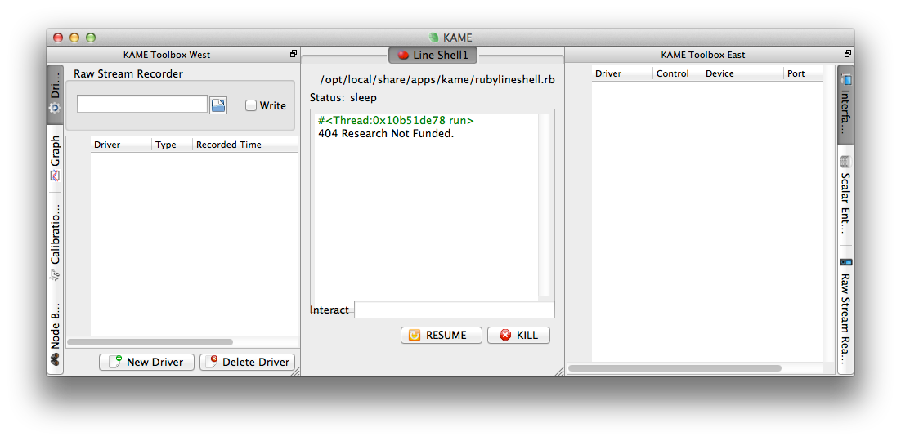

(First time) In the “Driver” tab, add the driver corresponding to your instrument using “New”.

(Subsequently) Load the saved .kam file via “File” → “Open”.

In the “Interface” tab, click “Start” for the driver. For GPIB/serial port etc., specify the address (port) in advance (see the chapter below).

Clicking on the driver name in the “Driver” or “Interface” tab opens the driver-specific settings window. (Some drivers do not have a settings window.)

“Scalar Entry”. This tab is used to save several measured values over time to a data file — for example, temperature and voltage. Setting “Delta” to positive outputs one line when the change exceeds that value. Setting it to negative outputs one line every time a new value is read. Clicking on a corresponding value shows a time-axis chart.

“Graph”. Create as many X-Y-(Z) graphs as needed. Values are selected from “Scalar Entry”.

“File” → “Save” saves most settings to a .kam file. Do this regularly.

### Text Box Operations

To prevent typos and adverse effects on instruments, most settings are not applied until you press the Enter key. Text turns blue while editing. If an incorrect format is entered, it turns red. Selecting another location without pressing Enter discards the input and shows the original value.

In most cases, values in text boxes can be controlled from Ruby scripts.

### Graph / Chart Operations

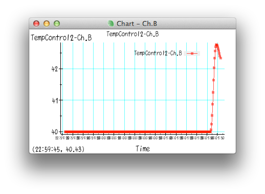

Even 2D graphs are rendered semi-transparently in 3D space.

Left double-click to open a detailed dialog.

Right double-click to show operation hints.

Left-click and drag to select a range in the plot to zoom in (auto-scale is stopped).

Right-click in the plot to return to auto-scale.

Use the scroll wheel in the plot to zoom.

Right-click and drag on an axis to zoom that axis (auto-scale is stopped).

Right-click on an axis to auto-scale that axis.

Use the scroll wheel on an axis to tilt in 3D.

Hold middle button and move to rotate freely in 3D.

Middle-click to reset the viewpoint.

When saveable data is available, a file bar appears at the top or bottom. Click the folder icon to select the file to save to. However, data is not saved at that moment — data at the instant you click “Export” is appended to the file. The icon changes after the first write.

Graphs with a “Math” button have analysis tools available. Results appear in Scalar Entry, but with a slight delay after the driver record time.

## Command Line Options

Normally not needed.

### --logging

Also logs communication content etc. Same as selecting “Enable Logging” from the menu.

### --nomlock

Never use mlock (does not lock KAME’s memory pages into RAM).

### --moduledir \<path\>

Adds a path for loading modules. Convenient when installed from source code.

## Menu Items

### File

#### Open

Loads a .kam file. The contents are Ruby scripts, so a script execution window opens in the center, and any errors are displayed in red.

#### Save

Saves all currently open drivers and some other settings to a .kam file. Internally, a snapshot is saved of all nodes controllable from Ruby that have the save attribute set.

#### Close

All drivers and calibration tables are deleted. Be careful not to press this accidentally.

#### Enable Logging

Communication logs with instruments, and node addition/deletion information, are also saved to /tmp/kame.log (kame.log in the execution folder on Windows). As this consumes disk space, stop it when not needed. With this active, adding a driver shows a “DUMMY” option in the interface. The dummy port can dump sent data to a file without actual communication.

#### Quit

Cancelled during measurement. Don’t forget to save.

### Measurement

#### Stop

Stops all measurements. Be careful not to press this accidentally.

### Script

#### Run

Loads a Python/Ruby script for automated measurement. Standard file types are .py/.seq. See the separate chapter for how to write scripts. Standard (error) output is saved to (filename).log in the same folder.

#### New Line Shell

Opens a window where you can type Python/Ruby scripts one line at a time. One window is already open at startup.

#### Launch Jupyter notebook

If Jupyter notebook is installed, calls it as a client to KAME’s embedded IPython and displays it in the default browser. The client’s Stop button does not function, so use sleep() instead of time.sleep() inside cells, and stop via the KILL button in KAME.

### View

Same as clicking on the tabs.

### Help

Not provided. Please refer to this manual.

## Message Window

Located at the far left since startup. Major messages, warnings, and errors are displayed here. More detailed information is recorded to standard output and /tmp/kame.log (kame.log in the execution folder on Windows).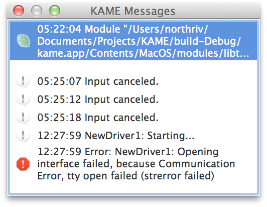

## Tabs

#### Driver

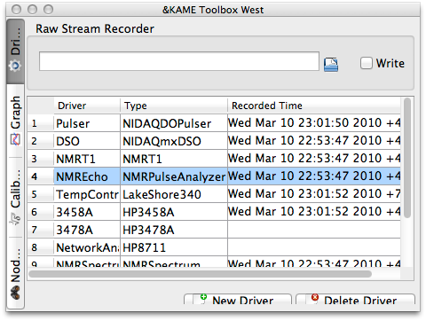

Drivers can be added or removed. Clicking on a driver name in the driver list opens the driver-specific settings window. The record time shows the time when the last data worth recording was received from the instrument.

Pressing “New Driver” opens the following window, where you can name and create the required driver. The name is difficult to change later, so choose carefully.  
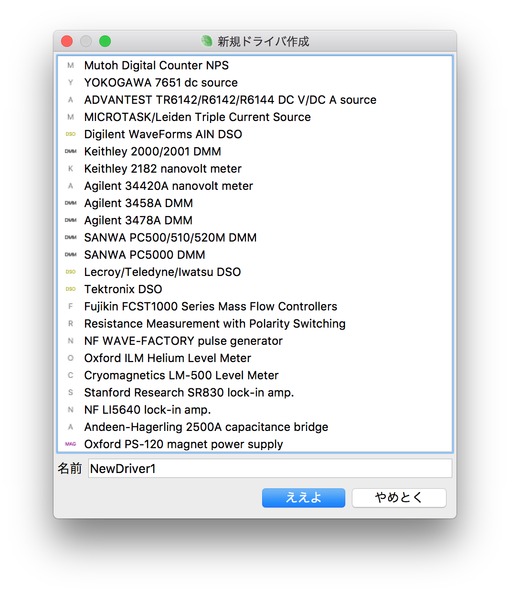

##### Raw Stream Recorder

Saves raw data as much as possible. While the “Write” checkbox is checked, for example, all oscilloscope waveforms are recorded. Data is compressed in GZIP format, but naturally consumes significant disk space.

#### Graph

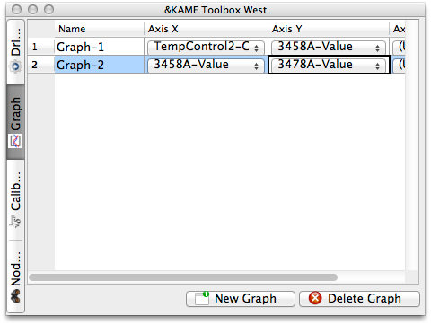

Generates 2D/3D graphs. Select X/Y/Z axes from items in “Scalar Entry”.

Data older than the set number of points is removed from the graph.

<span dir="rtl">“Live” shows all data recorded in memory; “Stored” shows data recorded to disk via the Text Writer.</span>

#### Calibration Table

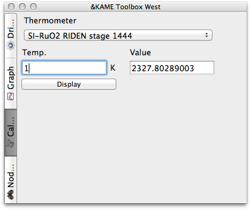

Used to define calibration data for thermometers. Currently, the definition file must be written manually as a Ruby script. Samples are in the kame/Measurements folder. Spline curve interpolation or Chebyshev polynomial definition are available.

Press “View” to display the calibration curve.

#### Node Browser

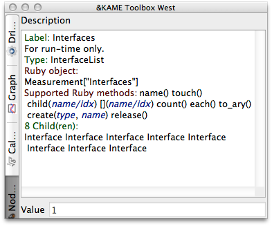

All data in KAME is managed in a tree structure. When controlling from Ruby scripts, access is done like: Measurement\["Drivers"\]\["driver1"\]\["foo"\].value=1.0. This tab shows how input items on screen are accessed in Python/Ruby. Script samples are in the kame/Sequences folder.

#### Interface

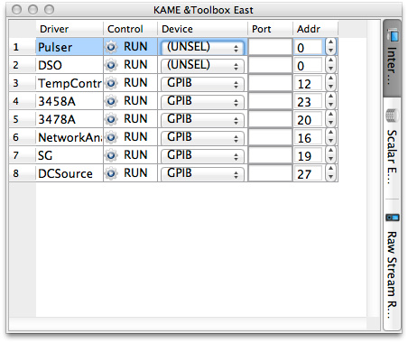

When a driver requires a communication path to an instrument, configuration items and Start/Stop buttons appear here. Usually one per driver. Set “Device”, “Port”, and “Address” correctly.

For serial ports: with RS-232C, an address is not required, but the port must be specified as a device file such as /dev/ttyUSB0 (Linux) or /dev/tty.usbserial (Mac). For RS-485, set the slave address. Right-click the port field to see candidates.

For NI488 GPIB: if there is only one board, “Port” can be left blank. For a Prologix USB-GPIB converter, set the port the same as for a serial port.

For TCP/IP: set “Port” to (IP address):(port number).

#### Scalar Entry

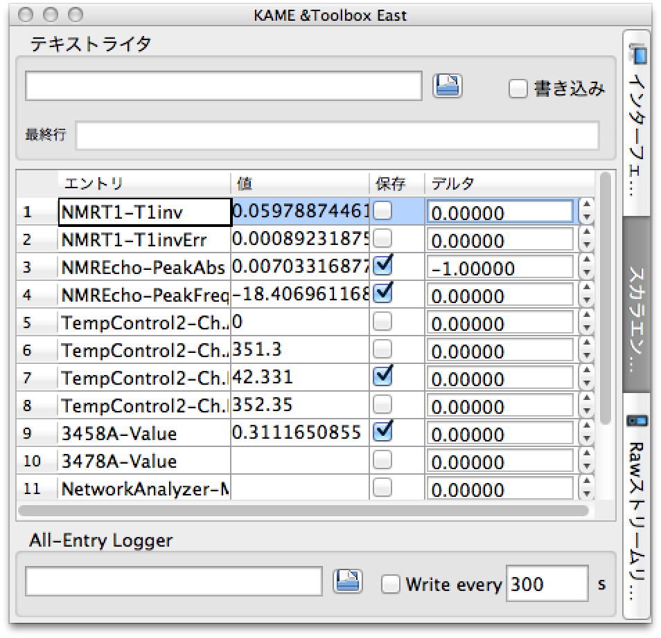

A list of numeric results recorded from drivers is displayed.

Clicking on a corresponding value shows a time-axis chart. Chart operations are the same as graphs, except the time axis cannot be auto-scaled.

##### Text Writer

Outputs “Save”-specified values to a text file, one line per entry, space-separated. Line endings are LF. No output unless “Write” is checked.

The timing of when one line is output is specified by “Delta”. Setting “Delta” to positive outputs one line when the change exceeds that value. Setting it to negative outputs one line every time a new value is read for that item.

To reorder items, hold CTRL and drag by the number.

##### Logger

Outputs all values to a text file, one line at specified intervals, space-separated.

#### Raw Stream Reader

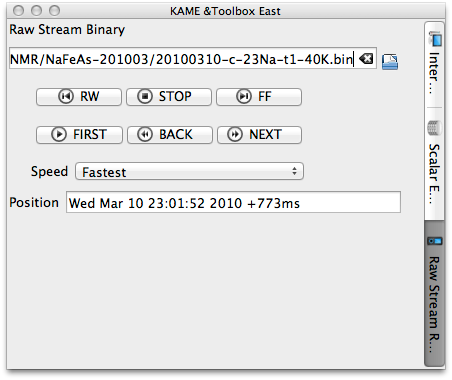

Reads and analyzes files output by the Raw Stream Recorder above. The rewind function has bugs, so for repeated analysis, go to “Start” and fast-forward with “Forward”. Fast-forward speed is set by “Speed”. “Position” shows the time when the record was recorded.

# Driver-Specific Settings

## DC Source

YOKOGAWA 7651 DC source (GPIB)

ADVANTEST TR6142/TR6144/R6142/R6144 DC source (GPIB)

MICROTASK/Leiden Triple Current Source (GPIB)

Optotune ICC4C-2000 lens current controller (Serial Port)

When using the 7651, it is safer to start it before other instruments.

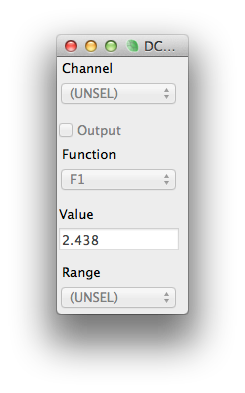

Scripting nodes: `Output` (on/off), `Value` (output setting), `Function`, `Range`, `Channel` (combo choices are model-specific — read them from the node tree).

## Digital Multimeter (DMM)

Keithley 2000/2001 DMM (GPIB)

Keithley 2851A nanovolt meter (GPIB)

Keithley 2182 nanovolt meter (GPIB)

HP/Agilent 34420A nanovolt meter (GPIB)

HP/Agilent 3458A/3478A DMM (GPIB)

Keithley 6482 picoammeter (GPIB)

SANWA PC500/510/520M/PC5000 DMM (IR SerialPort)  
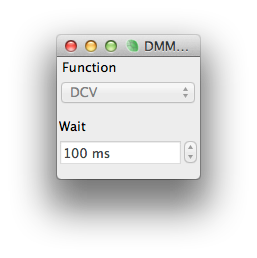

“Wait” sets the readout interval.

Values are sent to Scalar Entry.

Scripting nodes: `Function` (combo, model-specific), `WaitInms` (readout interval [ms]). Readings are read from the driver’s Scalar Entry, not a node.

## Digital Storage Oscilloscope (DSO)

Tektronix DSO (GPIB)

Lecroy/Iwatsu DSO (GPIB)

DSO on NI-DAQ M,S series (NI-DAQmx)

Thamway A/D conversion DV14U25 (USB)

Digilent WaveForms AIN DSO (USB)

Thamway PROT3 streaming DSO (TCP/IP, USB)

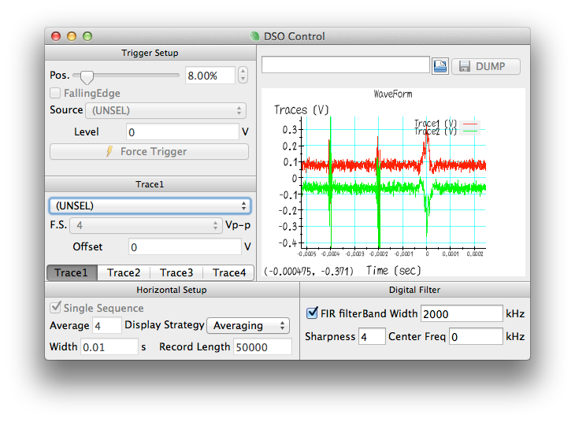

Set the vertical axis as full scale “F.S.” (not /DIV) and the horizontal axis as total “Width” (not per division).

For drivers that continuously acquire to a PC, a trigger source with time synchronization (such as the NMR pulser) calculates the trigger position in software.

Setting “Single Sequence” repeats accumulating the number of “Averages” and then clearing.

Setting “Display Mode” to “Averaging” is convenient as it updates the display as appropriate, but places a heavy load on GPIB and CPU. In “Single Sequence” mode, setting it to “Sequence” only displays when the specified number of averages is reached.

“Digital Filter” applies an FIR (Finite Impulse Response) filter. It applies the band specified by “Center Frequency” (fc) and “Band Width” (bw) to each channel, passing frequencies from fc−bw/2 to fc+bw/2. FIR processing is performed quickly via convolution.

Scripting nodes: `Average` (count), `SingleSequence`, `TrigSource`, `TrigFalling`, `TrigPos`, `TrigLevel`, `TimeWidth` (total horizontal width [s]), `VFullScale1`…`VFullScale4` (full scale, not /div), `VOffset1`…`VOffset4`, `RecordLength`, `Trace1`…`Trace4`, `FetchMode`, `ForceTrigger`/`Restart` (touchables), and the FIR set `FIREnabled`, `FIRBandWidth`, `FIRCenterFreq`, `FIRSharpness`.

## Function Generator

NF WAVE-FACTORY (GPIB)

LXI 3390 arbitrary function generator (LAN)

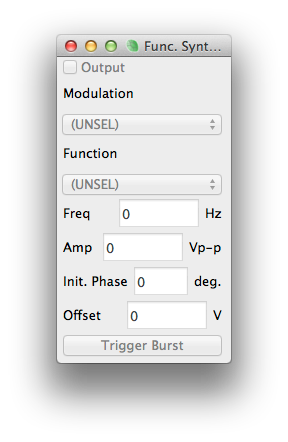

Control parameters (node names for scripting in parentheses):

- Output (`Output`) — turn the output on/off.
- Waveform (`Waveform`) — `SIN`, `SQU`, `RAMP`, `PULS`, `NOIS`, `DC`, `USER`, `PATT`.
- Frequency (`Freq`) [Hz], Amplitude (`Ampl`) [V], Offset (`Offset`) [V].
- Duty (`Duty`) [%] — duty cycle for the square wave, and for the pulse
  wave when Pulse Width is left at 0 (see below).
- Pulse Width (`PulseWidth`) [s] — for the `PULS` waveform. Width and
  Duty are two mutually exclusive ways to specify the pulse shape, so a
  **sentinel applies: `PulseWidth = 0` means “specify the shape by Duty
  instead.”** Enter a non-zero width to drive the pulse by width.
- Pulse Period (`PulsePeriod`) [s] — for the `PULS` waveform.
  **`PulsePeriod = 0` means “follow Frequency” (period = 1/Freq);** enter
  a non-zero value to override the period independently of Freq.
- Burst (`Burst`) — enable burst mode. Burst Phase (`BurstPhase`) [deg].
- Burst Cycles (`BurstCycles`) — number of cycles per burst.
  **`BurstCycles = 0` means INFinity** (continuous). With a BUS trigger
  source and infinite cycles, KAME issues a software trigger when the
  output is enabled.
- Trigger Source (`TrigSrc`) — `IMM`, `EXT`, `BUS`.

On connection KAME reads the instrument’s current waveform, frequency,
amplitude, offset, duty, burst state/phase/cycles and trigger source back
into these nodes; Pulse Width and Pulse Period start at 0 (the
Duty/Frequency-driven defaults) so that later Frequency changes keep
taking effect.

## Level Meter

Oxford ILM Helium levelmeter (GPIB, SerialPort)

Cryomagnetics LM-500 levelmeter (GPIB)

No settings window.

Values are sent to Scalar Entry.

## Lock-in Amplifier / Capacitance Meter

Stanford Resrearch SR830 lock-in amplifier (GPIB)

NF LI5640 lock-in amplifier (GPIB)

Signal Recovery 7265 lock-in amplifier (GPIB)

LakeShore M81-SSM synchronous source measure (USB)

Agilent/HP 4284A LCR meter (GPIB)

Andeen-Hagerling 2500A capacitance bridge (GPIB)

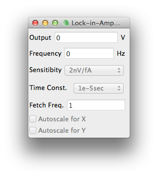

“Acquisition Frequency” is based on the reciprocal of the time constant.

X/Y values are sent to Scalar Entry.

Scripting nodes: `Output` (reference oscillator output), `Frequency`, `Sensitivity`, `TimeConst` (combos), `AutoScaleX`, `AutoScaleY`, `FetchFreq` (the “Acquisition Frequency”). The measured X/Y are read from the Scalar Entry.

## Superconducting Magnet Power Supply

Oxford PS/IPS-120 magnet power supply (GPIB, SerialPort)

Cryogenic SMS10/30/120/150C magnet power supply (USB Serial Port)

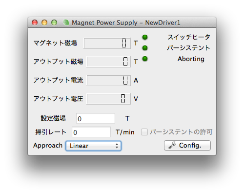

Persistent switch heater control is automatic. Checking “Allow Persistent” turns off the heater when the field reaches the set value. Setting “Approach” to “Oscillating” sweeps the field with a 20% overshoot.

Pressing the “Settings” button opens the following screen.

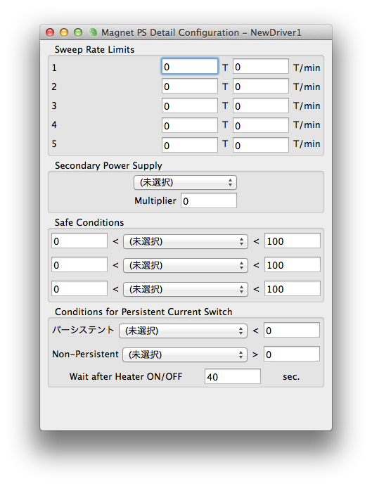

To set limits on sweep rate and maximum field, enter “Maximum Field” – “Rate” pairs in ascending order as needed in “Sweep Rate Limits”.

<span dir="rtl">“Secondary Power Supply” is used to drive shim coils.</span>

<span dir="rtl">“Safe Conditions” monitors scalar entry values and ramps the field to 0 if they go out of range.</span>

Similarly, conditions for the persistent switch can be added.

<span dir="rtl">Enter the switch heater wait times in “Wait after Heater ON/OFF”.

Scripting nodes: setpoints `TargetField`, `SweepRate`, `AllowPersistent`, `Approach` (`Linear`/`Oscillating`); readbacks `MagnetField`, `OutpuField` (sic — typo in the source node name), `OutputCurrent`, `OutputVolt`, `Stabilized`, `PCSHeater`, `Persistent`, `Aborting`. To sweep the field from a script, set `TargetField` and poll `Stabilized` (its magnitude is the time-averaged error).</span>

## Signal Generator (SG)

KENWOOD SG7130/SG7200 signal generator (GPIB)

DSTech. DPL-3.2XGF (SerialPort)

HP/Agilent 8643/8644/8648/8664/8665 signal generator (GPIB)

Rhode-Schwartz SML-01/02/03/SMV-03 signal generator (GPIB, SerialPort)

Thamway PROT NMR Control (TCP/IP, USB)

Keysight/Agilent E44xB signal generator (GPIB, LAN)

LibreVNA signal generator (USB)

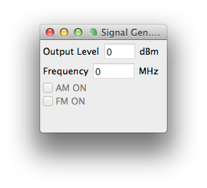

For PROT, NMR settings such as gain can be controlled.

Scripting nodes: `RFON` (output on/off), `Freq` [Hz], `OutputLevel`, `FMON`/`AMON` with `FMDev`, `AMDepth`, `FMIntSrcFreq`, `AMIntSrcFreq`; sweep control `SweepMode`, `SweepFreqStart`/`SweepFreqStop`, `SweepAmplStart`/`SweepAmplStop`, `SweepDwellTime`, `SweepPoints`.

## Network Analyzer

HP/Agilent 8711/8712/8713/8714 network analyzer (GPIB)

Agilent E5061/E5062 network analyzer (GPIB)

Copper Mountain TR1300/1,5048,4530 Network Analyzer (TCP/IP)

DG8SAQ VNWA3E w/ custom dll network analyzer (TCP/IP)

Thamway T300-1049A Impedance Analyzer (SerialPort)

LibreVNA network analyser (USB)

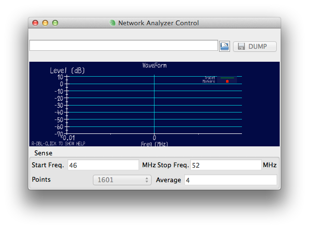

Outputs marker values to Scalar Entry.

Scripting nodes: `StartFreq`, `StopFreq`, `Points` (combo), `Average`, `Power`; calibration touchables `CalOpen`, `CalShort`, `CalTerm`, `CalThru`. Marker values are read from the Scalar Entry.

## Thermometer / Temperature Controller

Cryocon M32/M62 temperature controller (GPIB)

LakeShore 218 temperature monitor (GPIB)

LakeShore 340 temperature controller (GPIB)

LakeShore 350 temperature controller (GPIB)

LakeShore 370 temperature controller (GPIB)

LakeShore 372 temperature controller (GPIB)

Picowatt AVS-47 bridge (GPIB)

Oxford ITC-503 temperature controller (GPIB, SerialPort)

Neocera LTC-21 temperature controller (GPIB)

Keithley 2700 DMM w/ 7700 scanner (GPIB)

OMRON E5\*C controller (Serial Port Modbus RTU 57600bps)

Scientific Instruments 9302/9304/9308 temperature controller (GPIB)

LinearResearch LR-700 resistance bridge (GPIB)

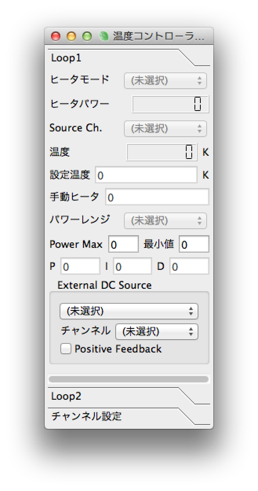

When “Thermometer” is selected, KAME converts resistance values etc. to temperature. The calibration curve can be checked in the “Calibration Table” tab.

Selecting “External Device” uses that DC source or flow control valve for PID control.

Values (resistance values etc. and temperature) are sent to Scalar Entry.

Although not displayed, the “Stabilized” node stores the time-averaged error of “Current Temperature” from “Set Temperature”.

Scripting nodes are grouped per control loop (each loop is a direct child node of the driver) and per sensor under the `Channels` list; the loop and channel node names are model-specific (a single-loop unit names its loop `Loop`, multi-loop units use names like `Loop1`/`Loop2` or `Loop#1`/`Loop#2`, and channel names follow the instrument, e.g. `A`/`B` or `1`/`2`) — read them from the node tree. Each loop exposes `TargetTemp`, `ManualPower`, `P`, `I`, `D`, `HeaterMode`, `PowerRange`, `Stabilized`, and `ExtDevice`/`ExtDCSourceChannel`/`ExtIsPositive` for control through an external DC source or flow valve. Each channel exposes its `Thermometer` selection, `Excitation`, and `Enabled`. To regulate temperature from a script, set the loop’s `TargetTemp` and poll `Stabilized`; temperatures and raw values are read from the Scalar Entry.

## Counter

Mutoh NPS digital counter (SerialPort)

No settings window.

Values are sent to Scalar Entry.

## Flow Controller

Fujikin FCST1000 Series Mass Flow Controllers (Serial Port 38400bps)

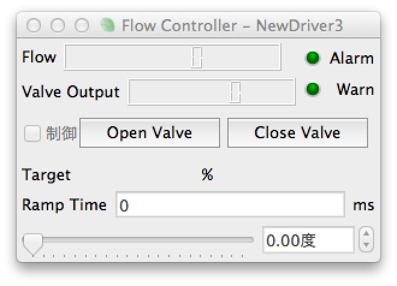

This is a mass flow controller driver.

Values are sent to Scalar Entry.

Scripting nodes: `Target` (flow setpoint), `Valve` (valve opening), `RampTime`, `Control` (regulation on/off), `OpenValve`/`CloseValve` (touchables), `Warning`/`Alarm` (status). The measured flow is read from the Scalar Entry.

## Motor Controller

OrientalMotor FLEX CRK motor controller (Serial Port Modbus RTU 57600bps)

OrientalMotor FLEX AR/DG2 motor controller (Serial Port Modbus RTU 57600bps)

OrientalMotor CVD2B/CVD5B motor controller (Serial Port Modbus RTU 57600bps)

OrientalMotor EMP401 motor controller (Serial Port)

SigmaOptics PAMC-104 piezo-assisted positioner (Serial Port)

Micro CAM z/x/ϕ positioner

Two-axis sample rotator

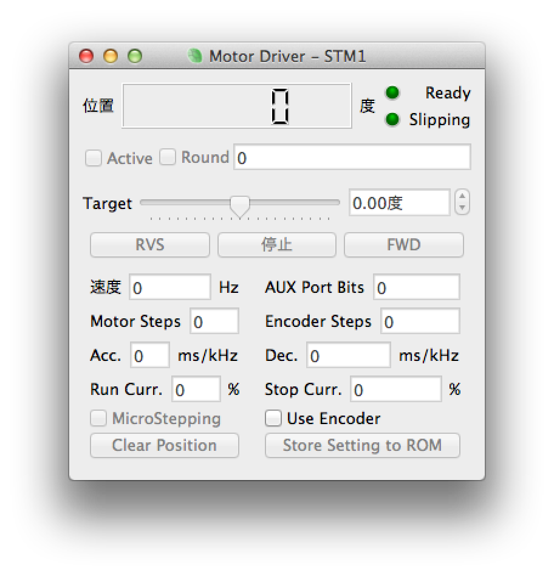

This is a stepper motor driver.

“Active” sets excitation ON/OFF.

Values are sent to Scalar Entry.

Scripting nodes: `Target` (target position), `Active` (excitation on/off), `Speed`, `TimeAcc`/`TimeDec` (accel/decel), `CurrentRunning`/`CurrentStopping`, `StepMotor`/`StepEncoder` (steps per rev), `MicroStep`, `Round`/`RoundBy`, `PushingMode`; status `Ready`, `Slipping`; touchables `ForwardMotor`, `ReverseMotor`, `StopMotor`, `GoHomeMotor`, `Clear`, `Store`. The current position is read from the Scalar Entry.

## Vacuum Gauge

Pfeiffer TPG361/362 vacuum gauge (Serial Port)

## Turbomolecular Pump Controller

Pfeiffer Turbo molecular pump controller TC110 (Serial Port)

Scripting nodes: `Activate` (pump on/off), `Heating`, `Standby`, `StandbyRotationSpeed`, `MaxDriverPower`; status `RotationSpeed`, `Warning`, `Error`.

## PPMS Controller

Quantum Design PPMS low-level interface (GPIB, Serial Port 9600bps)

Controls the Quantum Design Physical Property Measurement System 6000 controller.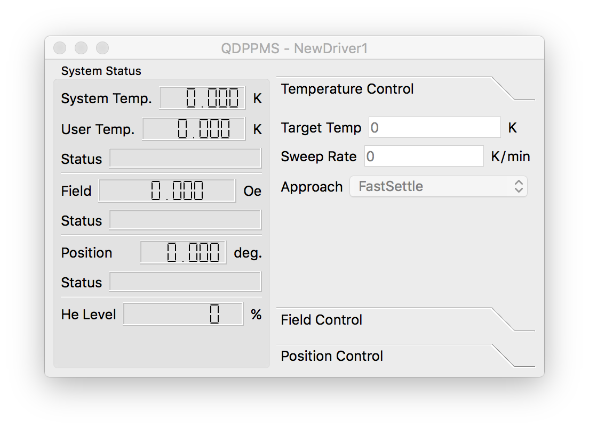

For serial communication, it appears to be able to communicate simultaneously with MultiVu’s GPIB control. Set the unit to 9600 bps, no flow control, CR+LF line endings, bit length/parity/stop bits = “8,N,1”.

Values are sent to Scalar Entry.

## Camera / Spectrometer

IEEE 1394 IIDC camera (Firewire)

Euresys eGrabber CoaXPress camera (PCIe)

Hamamatsu camera via Euresys Grablink CameraLink (PCIe)

JAI camera via Euresys Grablink CameraLink (PCIe)

OceanOptics/Insight USB spectrometer HR2000+/4000 (USB)

## Laser Module

Coherent Stingray laser diode driver (Serial Port)

Newport/ILX LDX-3200 laser diode driver (Serial Port)

Newport/ILX LDC-3700(C) laser diode controller (Serial Port)

Scripting nodes: `Enabled` (emission on/off), `SetCurrent`, `SetPower`, `SetTemp`, and `Status` (readback). Not every model honours every setpoint (current- vs. power- vs. temperature-controlled).

## NMR Pulser

NMR pulser on NI-DAQ M series (NI-DAQmx)

NMR handmade pulser on H8 (SerialPort)

NMR handmade pulser on SH2 (SerialPort)

NMR pulser Thamway N210-1026 PG32U40 (USB)

NMR pulser Thamway PG027QAM (USB)

NMR pulser Thamway N210-1026S/T (GPIB, TCP/IP: experimental)

Also see the appendix for DAQmx.

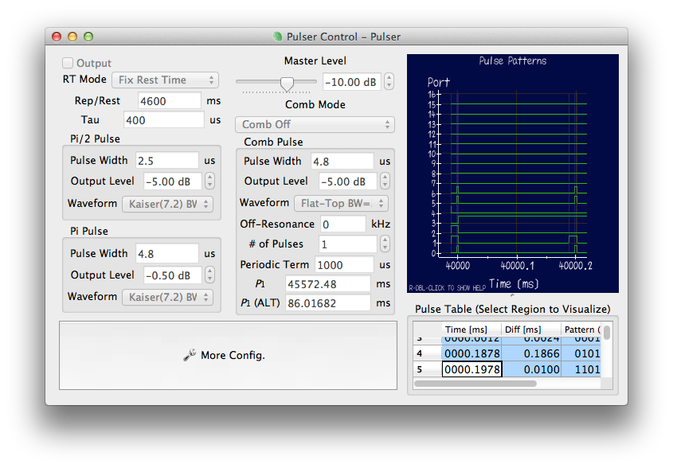

Scripting nodes (times are in this driver’s display units — match what the UI shows): `Output` (gate the sequence on/off), `RTMode` + `RT` (repetition/rest time, see below), `Tau`, `PW1`/`PW2` (π/2 and π pulse widths), `CombMode` + `CombNum`, `CombPW`, `CombPT`, `CombP1`/`CombP1Alt` (saturation comb), `EchoNum` (≥2 makes a CPMG train), `DrivenEquilibrium`, `ConserveStEPhase`. Phase cycling: `NumPhaseCycle`, `FirstPhase`, `InvertPhase`. QAM/level controls (QAM-capable pulsers only): `MasterLevel`, `P1Level`/`P2Level`/`CombLevel`, `QAMOffset1`/`QAMOffset2`, `QAMLevel1`/`QAMLevel2`, `QAMDelay1`/`QAMDelay2`, `DIFFreq`. Q-switch: `QSWDelay`, `QSWWidth`, `QSWSoftSWOff`, `QSWPiPulseOnly`. The per-port function assignment and the additional QAM settings live behind `MoreConfigShow` (a touchable that opens the extra panel in the UI). `PulseAnalyzerMode` and the `ODMR*` nodes (`ODMRSaturationPW`, `ODMRReadPulseSetupTime`, `ODMRReadPulseHoldTime`, `ODMRReadTimeOriginShift`) configure ODMR read pulses.

For standard pulsers not supporting QAM, the relevant parts (intensity, waveform, etc.) cannot be changed.

The graph on the right shows digital waveforms. Selecting a row shows the waveform for the selected range.

Setting “RT Mode” to “Fix Rep. Time” sets the repetition time of the Saturation (Comb) Pulse or 1st (Pi/2) Pulse to the “Rep/Rest” time regardless of P1. With “Fix Rest Time”, it waits for the “Rep/Rest” time after 2τ or the last pulse.

The reference for pulse time intervals etc. (“Tau”, “P1” etc.) is the center of the pulse. However, for the “Comb Pulse”, the reference is the center of the last saturation pulse.

Setting “Comb Mode” to “P1 ALT” alternates the P1 value. In that case, measuring T1 requires two FID/Echo measurement drivers. The “ASW” signal must be used for receiver gating.

Similarly, setting “Comb ALT” alternates between with and without comb pulses.

Pressing “More Settings” opens the following screen.

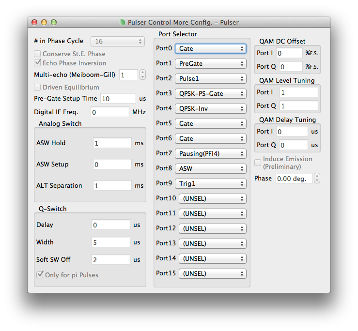

For “Phase Cycle Count”: up to 4 are standard cycles for pi/2 and pi pulses; beyond 4, the phase of Comb pulses also changes.

Checking “Conserve St.E. Phase” enables the phase cycle for Stimulated Echo measurement. Set Comb to 2 pulses, set the Comb pulse interval equal to τ, set the pi/2 pulse width to 0, and set the pi pulse width equal to the Comb pulse width.

Setting “Multi-Echo” to 2 or more creates a Carr-Purcell-Meiboom-Gill (CPMG) cycle. CPMG also phase-cycles. Appropriate settings in the FID/Echo measurement driver are also required.

Use “Port Selector” to choose the function of each port. “Gate”: pulse gate. “PreGate”: gate with setup time for power amplifier. “Trig1”: trigger signal rising at 2τ. “Trig2”: trigger signal rising at pi/2 pulse and falling at pi pulse. “ASW”: gate for receiver, goes high during the set period before and after 2τ. “QSW”: Q-switch output, goes high only immediately after pulses. “Pulse1”: pi/2 pulse. “Pulse2”: pi pulse. The QPSK logic is as follows. (Phase) “QPSK-A” “QPSK-B” “QPSK-NonInv” “QPSK-Inv” “QPSK-PS-Gate”: 0°: L L H L L; 90°: H L H L H; 180°: H H L H L; 270°: L H L H H. Incidentally, the western NMR group uses “QPSK-A” and “QPSK-B” logic, while the eastern NMR group uses “QPSK-PS-Gate” and “QPSK-Inv” logic.

## Current-Reversed Resistance Measurement

This is an analysis-only driver that takes the difference of voltage data from a DMM while reversing a DC source.

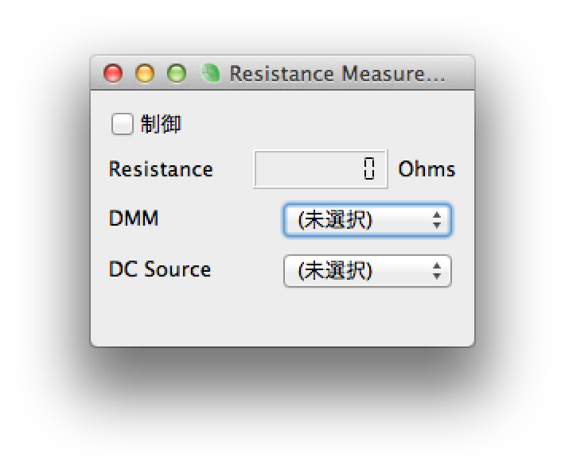

Values are sent to Scalar Entry.

Python-based 4-terminal resistance measurement Test4Res (simple) (pydrivers.py)

Python-based 4-terminal resistance measurement Py4Res (multi-current) (pydrivers.py)

## NMR FID/Echo Measurement

This is an analysis-only driver that removes background from DSO data, extracts a window, accumulates, and performs spectral analysis.

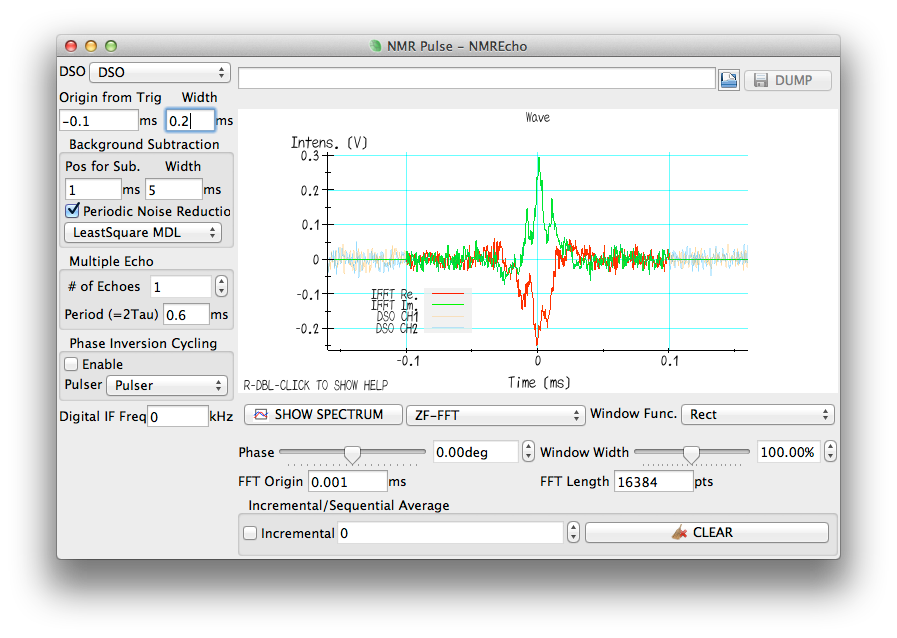

For standard echo observation, set the DSO trigger to 2τ (=“Trig1”) and put the DSO in “Single Sequence” mode.

Starting from “Position from Trigger”, “Width” cuts out the analysis range from DSO data. For “Multi-Echo”, the result is further averaged over “Echo Count” repetitions.

If “Background (BG) Subtraction” “Width” is non-zero, the average level from “BG Measurement Position” to that “Width” from the trigger is subtracted. To avoid degrading S/N, the subtraction “Width” should be much longer (several times or more) than the data “Width”. If “Periodic Noise Removal” is checked, dominant periodic external noise components are also estimated from the BG measurement (least-squares fit) and their extension subtracted. An information criterion algorithm can be selected for whiteness testing. This processing involves many FFTs and requires significant CPU power, but it is worth it. Always use it during frequency sweeps.

Checking “Phase Inversion Cycle” alternates between cases where the echo phase is inverted and non-inverted as seen by the DSO, and takes the difference. Time-dependent background components can be subtracted. For relaxation and spectrum measurements, the result of an even number of averages is passed on.

Checking “Incremental” clears the screen once and continues accumulating until “Erase” is pressed. The accumulation count is displayed. Useful when searching for a signal or taking FT.

Clicking “Spectrum Display” opens the following screen.

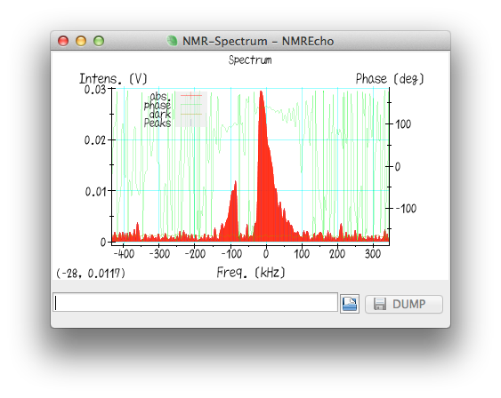

Normally, the result of ZF-FFT (Zero-Filling Fast Fourier Transform) is displayed. Set the FFT time-axis origin relative to the trigger position in “FFT Origin”. A “Window Function” can also be applied to the FFT.

The red portion “abs” is the absolute value of the complex FFT. If the FFT origin is correct, “phase” should be flat. “dark” is the noise level estimated from the background. “Peaks” shows peak values.

The main screen’s “IFFT Re.”/“IFFT Im.” shows the IFFT of the spectral analysis result — i.e., for ZF-FFT, just the windowed waveform. “DSO Re.”/“DSO Im.” shows the background-processed DSO waveform faintly.

The maximum value and its frequency are sent to Scalar Entry.

## NMR Relaxation Rate Measurement

This is an analysis-only driver that measures the relaxation rate from FID/Echo measurement results. It also controls the pulser. Cannot be used when FID/Echo is in incremental averaging mode. Window function settings are not inherited; they can be adjusted while viewing results.

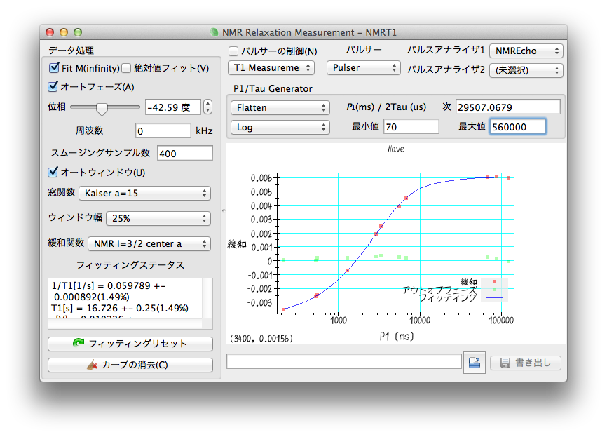

Checking “Control Pulser” clears the results once, and every time data is recorded, the next P1 etc. value is set on the pulser. For “Random”, the value is determined completely at random. For “Flatten”, unfilled regions are preferentially assigned. Setting “P1 Distribution” to “Log” searches uniformly on a logarithmic scale between “Min” and “Max”. The next scheduled value is shown in “Next” and can be changed as needed.

“Fitting Status” shows the least-squares fit result for the “Relaxation Function”.

Checking “Auto Phase” selects the phase that maximizes the change.

“Smoothing Samples” specifies the number of divisions for grouping nearby horizontal-axis values before fitting.

Checking “Auto Window” selects the window function that maximizes S/N, but turn this OFF if frequency dependence is physically important (e.g., in superconducting states).

<span dir="rtl">Checking “Fit M(infinity)” also makes the t→∞ value a fitting parameter. Turn OFF for standard T2 measurements.</span>

“Frequency” sets the center frequency of the analysis range for the FID/Echo signal. Changing this value clears previous measurement results.

“Fitting Reset” randomly initializes the fitting parameters and restarts the fit when fitting is not working well.

When the pulser is set to “P1 ALT” or “Comb ALT”, two FID/Echo analysis drivers must be set.

Values (1/T1,2,st.e. and errors) are sent to Scalar Entry.

## NMR Frequency Sweep Measurement

This is an analysis-only driver that measures a frequency sweep spectrum from FID/Echo measurement results. It also controls the SG. Cannot be used when FID/Echo is in incremental averaging mode. Window function settings are not inherited; they can be adjusted while viewing results.

Performs the so-called Fourier Step Sum (FSS), accumulating ZF-FFT results while shifting. However, by converting back to the time domain, post-processing window function selection is enabled.

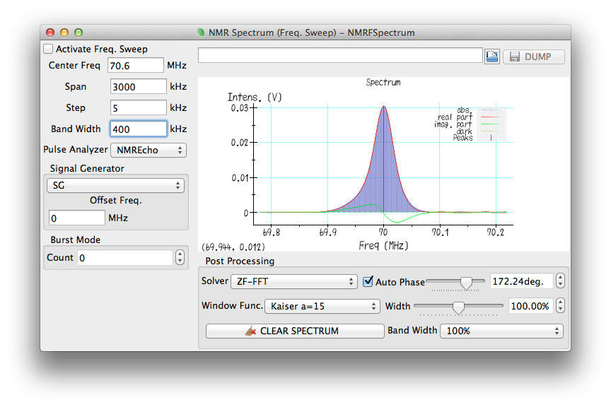

Checking “Start Sweep” clears the results and changes the SG frequency in “Step” increments from “Center Frequency” − “Span”/2.

“Auto Phase” selects the phase that maximizes the real part, but phase is typically meaningless in frequency sweeps.

The FSS “Band Width” can be specified numerically before measurement begins, or selected from 3 options during post-processing: “50%”, “100%”, “200%”.

“LC Tuning” selects how to tune the circuit during sweeps. “As is” does nothing. “Auto Tune” uses the auto-tuner driver to tune at each “Step”. “Await” turns off the pulse at each “Step” and waits for the user to turn the pulse back on.

## NMR Field Sweep Measurement

This is an analysis-only driver that measures a field sweep spectrum from FID/Echo measurement results. The field value is read from the magnet power supply driver or a DMM. Cannot be used when FID/Echo is in incremental averaging mode. Window function settings are not inherited; they can be adjusted while viewing results.

Performs the Fourier Step Sum (FSS) by accumulating ZF-FFT results while shifting. However, by converting back to the time domain, post-processing window function selection is enabled.

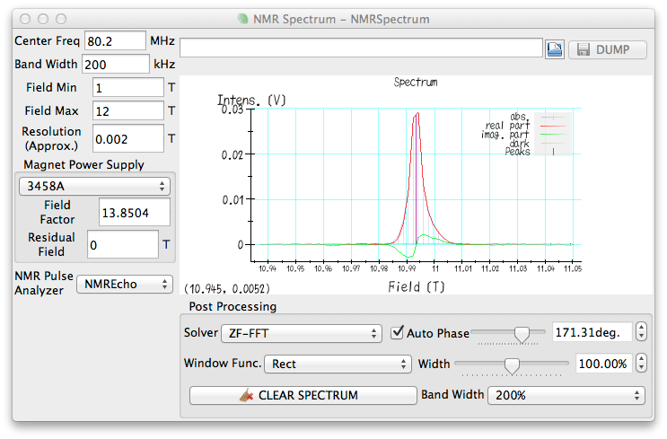

See also the frequency sweep section for explanation of settings.

Internally, during FSS, the frequency origin is set to −log(H) × “Center Freq”. This allows correct accumulation even when shifting the field for pure NMR. Effective when the resonance frequency is proportional to the field, or when “Center Freq” \>\> 0.001 × “Band Width”.

The field value used is the read value multiplied by “Field Factor”, plus the “Residual Field” value.

Field control must be done by a separate driver or manually.

<span dir="rtl">“Resolution (Approx.)” specifies the horizontal axis precision, but changing this during measurement may clear the results.</span>

## NMR Auto LC Tuner

This is an analysis-only driver that adjusts an LC resonant circuit while monitoring a vector network analyzer. It performs fitting assuming a series LCR resonant circuit, estimating capacitor displacement and backlash while tuning. Before and after adjustment, it toggles the “AUX” bit of the motor driver, which can be used for RF relay connections.  
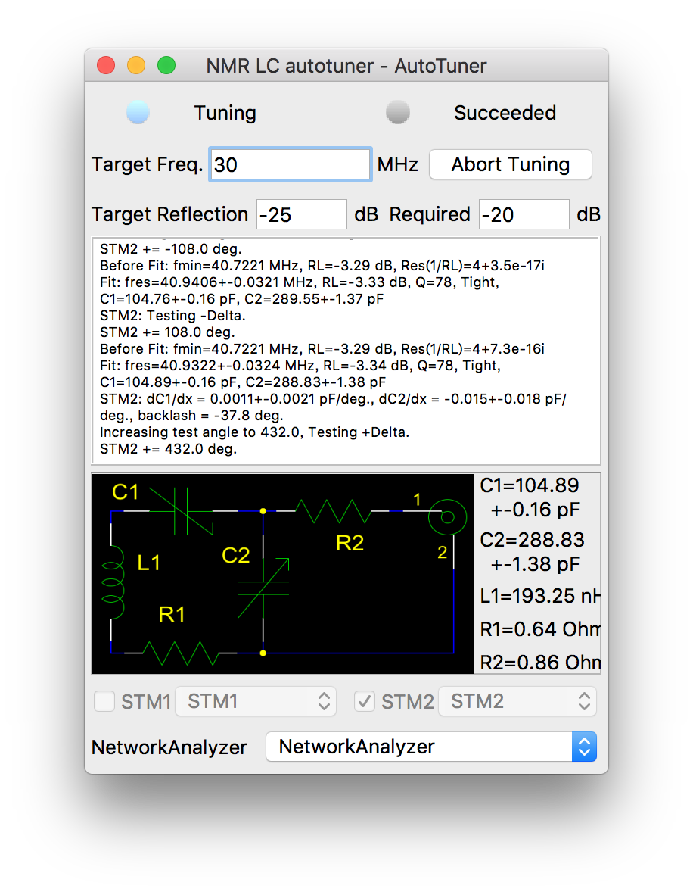

# Script Control

Control via Python (+ IPython)/Ruby is possible. Inside KAME, dedicated Python/Ruby threads run continuously; a monitor program (kame/script/pythonsupport.py, rubysupport.rb) creates new Python/Ruby threads to load and execute scripts (.py, .seq).

Standard input and output are redirected and displayed in the center of KAME. Character encoding is UTF-8.

If an error occurs, the backtrace is displayed in red.

The numpy as np / Math modules are pre-loaded.

Communication and control with KAME is done via XNode class objects. These objects are organized in a tree structure, with the Measurement object as the root.

Hovering the mouse pointer over a control target shows the Python/Ruby object name, method list, and current value in the “Node Browser” tab.

Python supports nearly the same features as C++; refer to modules/python/pydrivers.py. help(hogehoge), inspect.getmembers(hogehoge), and Jupyter’s tab completion are also useful.

### Control from Python

To access KAME’s node tree from Python, start from the Root() object. Use Snapshot to read values and Transaction to write values.

```python
root = Root()  # root of the node tree

# Read a value (Snapshot)
shot = Snapshot(root)
print(shot[root])  # payload of the root node

# Access child nodes
tempcontrol = root["tempcontrol"]
print(float(tempcontrol["temp"]))  # XDoubleNode can be converted to float

# Write a value (Transaction)
for tr in Transaction(tempcontrol["setpoint"]):
    tr[tempcontrol["setpoint"]] = 4.2  # Auto-retry on conflict
```

To write a driver in Python, subclass XPythonDriver\<T\> and register it with exportClass(), then it will be instantiated by the framework in the same way as compiled drivers.

```python
class MyDriver(kame.XPythonCharDeviceDriverWithThread):
    def analyzeRaw(self, reader, payload):
        payload.local()["value"] = float(reader.pop_string())
    def visualize(self, shot):
        ...

MyDriver.exportClass("MyDriver", MyDriver, "My Instrument")
```

KAME has an embedded IPython kernel; when IPython is available, a Jupyter client can be connected to the running process for interactive operation and live plotting. Launch via “Script → Launch Jupyter notebook” in the menu.

The following is about Ruby.

The XNode class supports methods similar to Array.

For example, Measurement\["Drivers"\]\["NMRT1"\]\["P1Min"\] accesses the control target object (in this case, an XDoubleNode class).

The XValueNode class and its subclasses support assignment via the value= method and value retrieval via the value method.

Ruby control has a slight time lag, so when assigning values consecutively, include appropriate sleep intervals.

### Ruby Example (Saving spectra at each temperature)

```ruby
def wait_within(node, val, min_wait, timeout, incr = 1)
  tstart = Time.now
  print "Wait for stabilize '#{node.name}' within #{val}"
  sleep min_wait
  while tstart + timeout > Time.now
    if node.get().abs <= val then
      print "OK. #{Time.now - tstart} sec. lost"
      return true
    sleep incr
  end
  print "Time out #{Time.now - tstart} sec."
  false
end

tempctl = Measurement["Drivers"]["TempControl2"]
pulser = Measurement["Drivers"]["Pulser"]
pulse = Measurement["Drivers"]["NMREcho"]

for temp,rept in [[10,100],[20,50],[40,25]]
  print "T=#{temp}K\n"
  pulser["RT"].value= rept
  pulser["Output"].value= true
  tempctl["TargetTemp"].value=temp

  pulse["ExAvgIncr"].value= false
  sleep(3)
  pulse["ExAvgIncr"].value= true
  pulse["Spectrum"]["FileName"].set("hogehoge-#{temp}K-ft.dat")
  slp = [300.0, rept*100/1000.0].max()
  sleep(slp)
  pulse["Spectrum"]["Dump"].touch()

  wait_within(tempctl["Stabilized"], temp/100.0,30,36000)
end
```
end

# Software Transactional Memory (STM)

KAME’s core data model is a lock-free, snapshot-based STM (Software Transactional Memory). All instrument data is stored in a tree of Node\<XN\> objects; reads and writes are done via snapshots and transactions rather than locks.

Reading (O(1) snapshot):

```cpp
Snapshot<NodeA> shot(node); // Atomic load, no lock needed
double x = shot[node].m_x;
```

Writing (optimistic transaction, auto-retry):

```cpp
node.iterate_commit([](Transaction<NodeA> &tr) {
    tr[node].m_x += 1; // Copy-on-write on first access
}); // Auto-retry on conflict
```

This STM operates without deadlocks in a multi-threaded environment; the UI thread never blocks hardware I/O. Python and Ruby scripts also access the node tree through the same transaction API.

#### Node Tree Structure

Instrument data is stored in a tree of Node\<XN\> objects:

```
Node<XN>
 └─ Linkage ──atomic_shared_ptr──▶ PacketWrapper
     └─ Packet
         ├─ Payload (user data)
         └─ PacketList (child packets)
```

#### Commit Mechanism

1. A Transaction saves m_oldpacket at construction time.

2. operator\[\] clones the payload on first write (copy-on-write) and assigns a unique serial number.

3. commit() performs a single CAS operation on the Linkage; if packet ≠ m_oldpacket, it detects a conflict and retries.

4. Event notifications to listeners are only sent after a successful commit (intermediate states are invisible externally).

Multi-node consistency is guaranteed by the “bundling” protocol. The parent packet absorbs child packets with a multi-phase CAS protocol, making the entire subtree consistent under a single atomic pointer. The m_missing flag marks stale child packets and triggers re-bundling as needed.

Collision backoff: Linkage::negotiate() uses the m_transaction_started_time timestamp to impose proportional waits on conflict detection, preventing livelock.

iterate_commit_while(lambda) can abort the retry loop by returning false from the lambda, useful for conditional transactions.

#### Lock-Free atomic_shared_ptr

The O(1) snapshot reads and CAS-based commits above require a shared pointer that is itself lock-free. atomic_shared_ptr (in kamepoolalloc/atomic_smart_ptr.h, introduced in January 2006 as part of the 2.0-beta3 rewrite) provides this. It is a custom implementation of what C++20 calls std::atomic\<shared_ptr\>.

The core technique embeds a small local reference counter in the low bits of the pointer to the reference-control block — bits guaranteed zero by allocator alignment. reserve_scan\_() atomically increments this local counter via CAS to "pin" the pointer for reading; leave_scan\_() decrements it. Between these two calls, even if another thread swaps the pointer, the object cannot be freed because the local count is non-zero. A separate global reference counter in the control block tracks long-lived ownership. Setters transfer any outstanding local count to the global counter before swapping, so leave_scan\_() can fall back to decrementing the global counter if the pointer changed.

For types that inherit atomic_countable (notably Payload), the global reference counter is stored inside the object itself (intrusive counting), eliminating a separate heap allocation per shared-pointer instance.

Comparison with standard-library implementations (as of late 2024): libstdc++ (GCC) uses a spinlock, vulnerable to priority inversion. MSVC uses a lock bit + WaitOnAddress, blocking under contention. libc++ (Clang) has not yet implemented it. KAME’s implementation (2006–) uses tagged-pointer CAS and is truly lock-free.

\[Note\] Taking a nested Snapshot inside a transaction in a tree with hard links (children with two parents) may break consistency. Use tr\[\*node\] instead of a nested Snapshot in such cases.

*(The following was written by Claude based on source code analysis.)*

#### Comparison with Other STM Designs

Common STMs (Haskell TVar, Clojure dosync, ScalaSTM) are “flat”, operating on a set of independent transactional variables. KAME’s STM is “tree-structured”: the entire instrument node tree is shared state, and snapshots are always consistent at the subtree level.

Key design differences:

Conflict granularity: flat STM = per-variable / KAME = per-packet (subtree root)

Read model: flat STM = readTVar/deref / KAME = Snapshot (outer) or tr\[\*node\] (inner)

Consistency scope: flat STM = explicitly specified variables / KAME = entire subtree via bundling

Commit log: flat STM = redo log or write set / KAME = copy-on-write + single CAS

Retry: flat STM = retry/orElse / KAME = iterate_commit/iterate_commit_while

Blocking: flat STM = aborts on read-set change / KAME = none (timestamp backoff)

Memory management: flat STM = GC / KAME = lock-free atomic_shared_ptr (reference counting)

Comparison with Intel TSX/RTM (hardware transactional memory): HTM aborts on cache-line conflicts even for logically independent operations, and has strict capacity limits. KAME’s STM only aborts on packet identity changes (semantic conflicts), tolerates large read sets, and degrades via software backoff rather than falling back to a global lock.

Comparison with TinySTM/NOrec (C library STMs): These use a global version clock, per-object version stamps, and per-transaction read/write logs. KAME has no read log; Snapshots are merely immutable pointers, so reads outside transactions have truly zero overhead. Instead, the write path clones the payload in advance.

Why KAME’s STM is effective for laboratory software:

① No deadlocks: locks are never held across hardware I/O or UI redraws. Slow UI threads never block fast data acquisition threads.

② Multi-instrument consistency: a Snapshot of any subtree is always internally consistent. Even when multiple drivers update simultaneously, the data seen by the UI is always in a coherent state.

③ Safe access from Python/Ruby scripts: scripts manipulate the node tree via the same transaction API as C++, so scripts never corrupt instrument state regardless of execution timing.

# AI-Assisted Experiment Automation (MCP)

KAME 8.0 includes a built-in Model Context Protocol (MCP) server. MCP is an open protocol developed by Anthropic that provides a standard interface for AI assistants (such as Claude) to interact with external tools.

KAME’s MCP server connects to the embedded IPython kernel via jupyter_client, allowing AI assistants to execute Python code directly in KAME’s interpreter. The same environment available in Jupyter notebooks — Root(), Snapshot(), Transaction(), and all loaded drivers — is fully accessible to the AI.

## Available Tools

| Tool | Description |
|------|-------------|
| `kame_api` | Retrieve the Python API quick reference (for AI orientation) |
| `kame_manual` | Retrieve this manual — table of contents or a specific section |
| `execute_code` | Execute arbitrary Python code in KAME's interpreter; returns text and matplotlib plots |
| `execute_code_async` | Run long experiments in a background thread; returns a job id |
| `get_result` | Check the status/progress of an asynchronous job |
| `stop_job` | Request a cooperative stop of a running asynchronous job |
| `tree` | Browse the node tree (names, types, values) to a given depth |
| `kame_status` | Check KAME status and list active drivers |
| `notebook_status` | Open notebooks, kernel busy/idle, currently executing cell |
| `notebook_read` | Read notebook cells with indices |
| `notebook_edit` | Replace/insert/delete a cell on disk (reload the browser tab afterwards) |

## Usage Examples

Simply instruct the AI assistant in natural language:

- "Read the current temperature from LakeShore1"

- "Sweep the magnetic field from 0 to 5 T in 0.1 T steps, recording NMR signal at each point"

- "Plot the last 100 DMM readings"

## Setup

1. Install required packages:

   ```
   pip install mcp jupyter_client
   ```

2. Launch KAME and start a Jupyter notebook via Script → Launch Jupyter Notebook.

3. KAME automatically generates .mcp.json in the notebook workspace directory.

4. Open Claude Code in the same directory — the MCP server is discovered automatically.

5. The .mcp.json file is cleaned up when KAME exits.

## Technical Highlights

- Connects to KAME’s embedded IPython kernel via ZMQ (jupyter_client)

- Uses stdio transport for inter-process communication

- Includes kame_python_api.md — an API reference automatically read by the AI before writing code, minimizing trial-and-error

- To our knowledge, this is the first measurement software to integrate an MCP server, enabling direct AI-to-instrument interaction

# FAQ

### GPIB Communication Errors?

Common causes are wrong addresses or cables that are too long, but occasionally there are compatibility issues between instruments. Older Oxford instruments, the YOKOGAWA 7651, and Cryocon do not fully comply with the IEEE 488.2 standard, which can cause problems when many instruments are connected. Try reducing the number of instruments or switching some to serial communication.

### Serial Port Settings?

Unless specified otherwise above, 9600 bps, no parity.

### Using Instruments Not Supported by KAME?

You need to create a driver. You can create one by referencing the modules/ folder in the source code, but if it is difficult, contact Kitagawa. Adding a new digital voltmeter model requires only minor work. To create a driver in Python, refer to modules/python.

# Appendix (obsolete)

## NMR System Using NI DAQmx Devices (Pulser and Oscilloscope/Averager)

I use a S-series PCI-6111 (2ch, 12-bit, 5 MSps) as the A-D converter. When using QAM for modulation, the D-A conversion portion is also used. The higher-end PCI-6115 can also be used.

Internally, all data is taken into a ring buffer in real time and accumulated in software. Therefore, regardless of the repetition time, data is not lost as long as the acquisition ranges do not overlap. The number of averages is unlimited, but since the DSO driver accumulates in 32-bit, accumulations exceeding 65536 must be done in combination with the NMR Echo driver.

For the pulser, I use an M-series PCIe-6251 (DIO 8ch, 10 MHz). The PCI-6220 can also be used, though it is slower. The PCIe-6251 is discontinued; operation of its successor PCIe-6351 has not yet been verified.

Other required external terminals etc.:

For PCI-6111: SH68-68-EP × 1, BNC-2110 × 1

For PCIe-6251: CB-68LPR × 1, SHC68-68EPM × 1, CA-1000 Box × 1, CA-1000 Rack Mount × 1 set, CA-1000 BNC Panel × 4, CA-1000 Cover × 5

are used.

Also, an RTSI cable connection is required for clock/trigger synchronization between the two boards.

The CA-1000 BNC panel uses isolated BNCs, but these must be replaced with non-isolated BNCs; otherwise, glitches will be observed mixed into the NMR echo.

#### S-Series Devices

AI0,1 (2ch) or AI0-3 (4ch) are the input terminals for A-D conversion. In NMR, connect to the PSD output of the receiver. Note that some receivers have the 0° and 90° ports swapped.

Select “National Instruments DAQ as DSO” as the driver.

When using QAM for modulation, select “NMR pulser NI-DAQ M Series with S Series” as the pulser driver, and select the S-series for the second interface. Connect AO0,1 to the QAM.

#### M-Series Device Pulser Connections

When not using QAM, select “NMR pulser NI-DAQ digital output only” as the pulser driver.

When using the S-series as a DSO, in the DSO “Trigger Settings”, select the appropriate pulser line for “Source”. Since triggering is done in software, a physically nonexistent port is fine. It is recommended to set port 8 to “Trig1” and set “Source” to “Pulser name/line8”, which places the trigger at the 2τ position. Due to software triggering, after changing the DSO vertical/horizontal axis settings, you must turn the pulser OFF/ON again or triggering will not work.

This applies to all pulsers: do not connect to a powered-off instrument or terminate in 50Ω while outputting. This is nearly the same as a short circuit.

In the OFF state, ports are open, so the GATE and PRE-GATE ports should be pulled to GND through several kΩ.

Refer to the following photo for connections.

Port 7 is reserved for internal operation (though it can be changed in settings). It is used to pause counting and rest the board when there are no signal changes from the pulser. In that case, connect P0.7 (J48) and PFI4 (J41) (blue wire in the photo). Also, in the NMR pulser settings under “More Settings”, set port 7 to “Pausing (PFI4)”.

The connection table is as follows. (Port) (DAQ Port Name) (Terminal No.) Port 0: P0.0 J52; Port 1: P0.1 J17; Port 2: P0.2 J49; Port 3: P0.3 J47; Port 4: P0.4 J19; Port 5: P0.5 J51; Port 6: P0.6 J16; Port 7: P0.7 J48 / PFI4 J41; GND: D-GND: any of 4,7,9,12,13,15,18,35,36,44,50,53

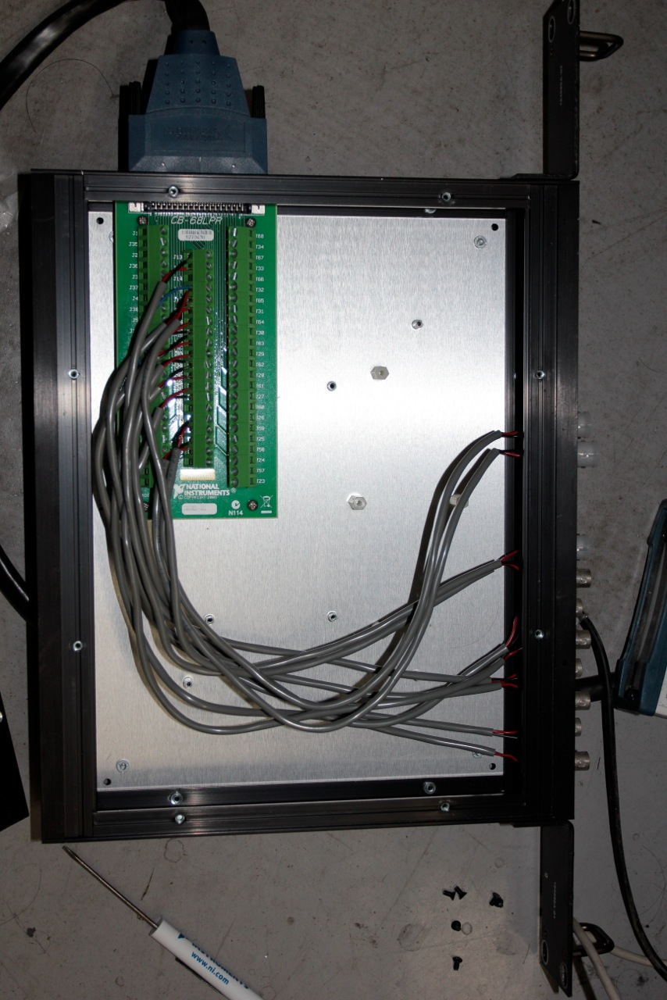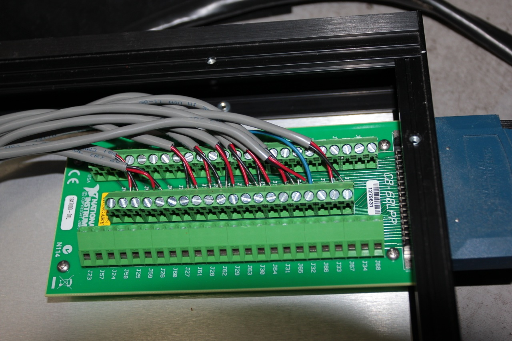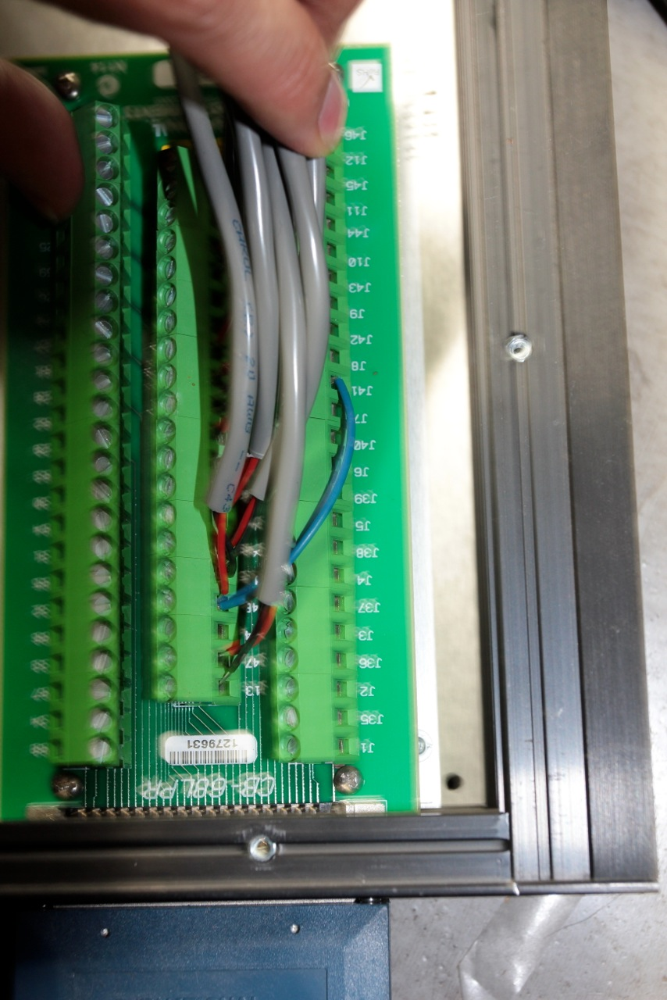
